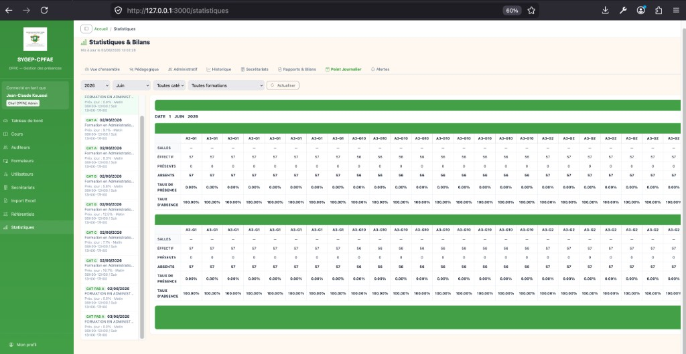
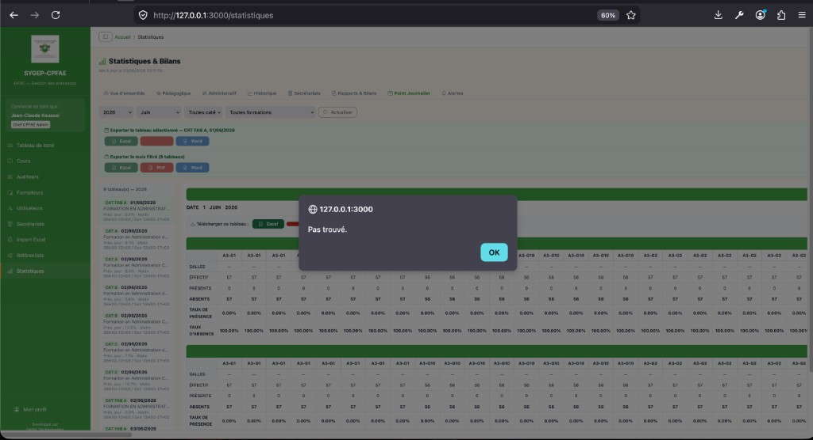
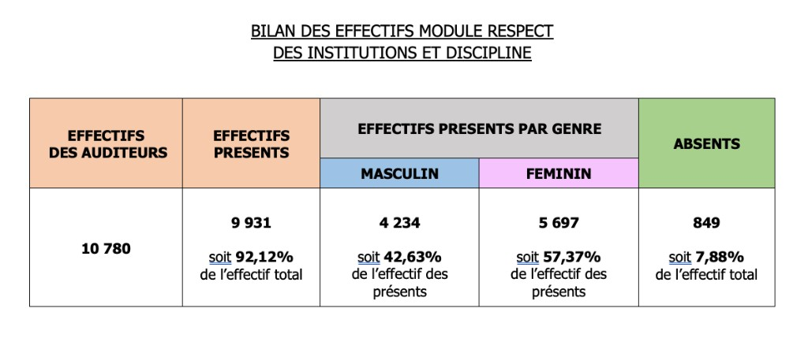
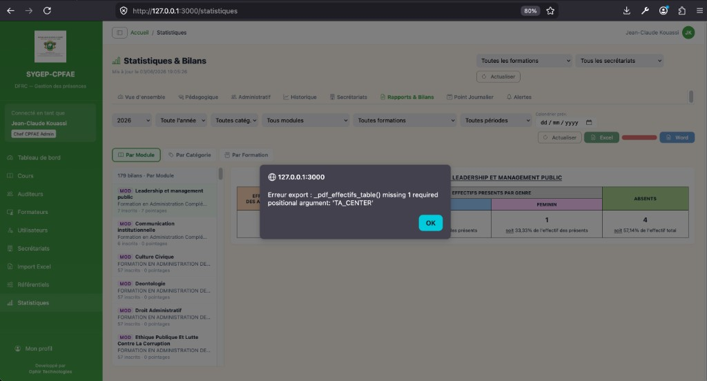
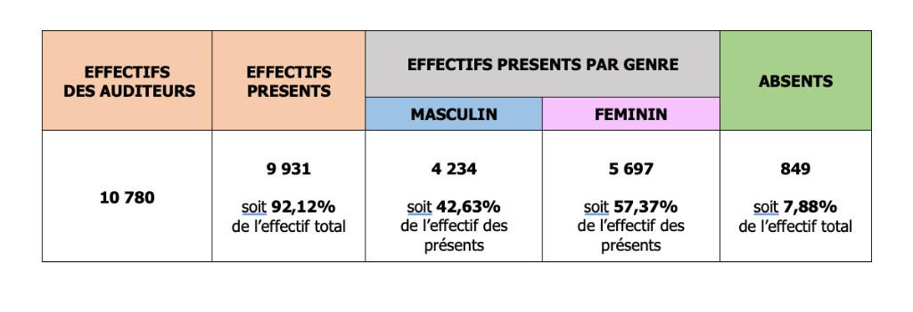
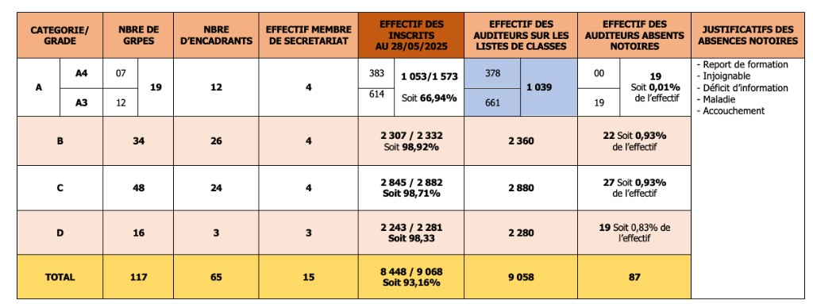
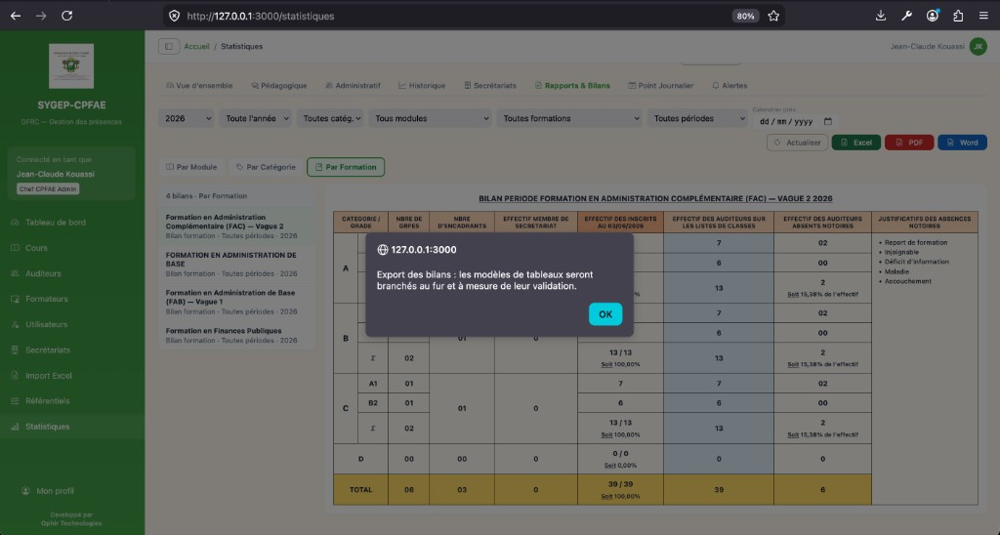
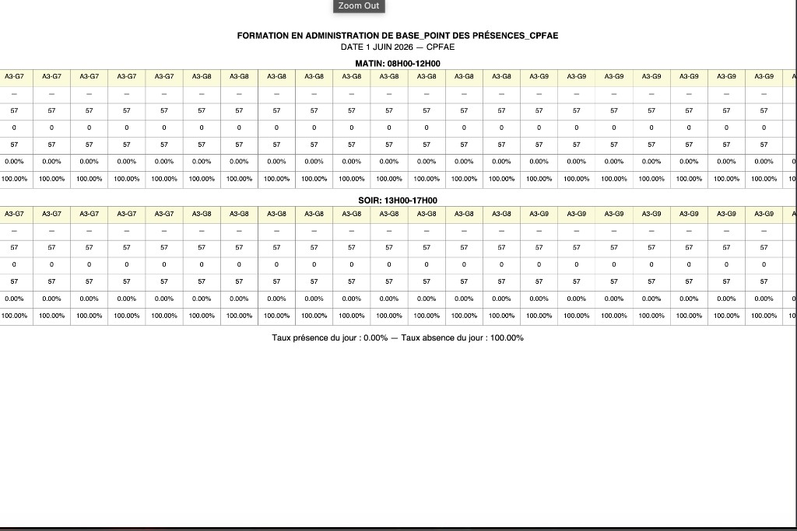
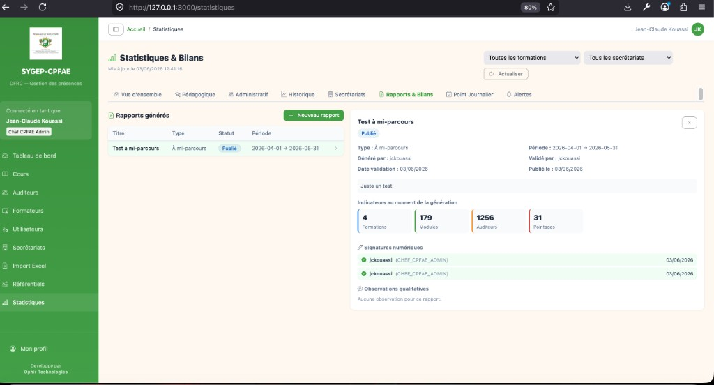

# Manuel utilisateur — App Statistiques (SYGEP-CPFAE)

| | |
|---|---|
| **Application** | SYGEP-CPFAE — Module Statistiques & Bilans |
| **Version du manuel** | 2.0.1 |
| **Dernière mise à jour** | 05/06/2026 |
| **Public** | Administrateurs CPFAE, direction, secrétariats, encadrants autorisés |
| **Fichier Word** | `Manuel utilisateur App Statistiques.docx` (généré automatiquement) |

---

## Table des matières

1. [Introduction](#1-introduction)
2. [Accès au module](#2-accès-au-module)
3. [Profils, rôles et droits](#3-profils-rôles-et-droits)
4. [Interface générale](#4-interface-générale)
5. [Glossaire et notions CPFAE](#5-glossaire-et-notions-cpfae)
6. [Onglet Vue d'ensemble](#6-onglet-vue-densemble)
7. [Onglet Pédagogique](#7-onglet-pédagogique)
8. [Onglet Administratif](#8-onglet-administratif)
9. [Onglet Historique](#9-onglet-historique)
10. [Onglet Secrétariats](#10-onglet-secrétariats)
11. [Onglet Rapports & Bilans](#11-onglet-rapports--bilans)
12. [Onglet Point Journalier](#12-onglet-point-journalier)
13. [Onglet Alertes](#13-onglet-alertes)
14. [Bonnes pratiques](#14-bonnes-pratiques)
15. [Dépannage](#15-dépannage)
16. [Journal des mises à jour](#16-journal-des-mises-à-jour)

---

## 1. Introduction

### 1.1 Objet du module

Le module **Statistiques & Bilans** centralise l'ensemble des indicateurs pédagogiques, administratifs et opérationnels de la CPFAE. Il permet de :

- **Piloter** l'activité formations / secrétariats à partir de données de pointage en temps quasi réel ;
- **Analyser** les taux de présence, d'absence, d'abandon et d'exécution des volumes horaires ;
- **Consulter et exporter** les tableaux officiels CPFAE : bilans par module, catégorie ou formation, et points journaliers ;
- **Anticiper** les dérives grâce aux alertes configurables par seuils.

### 1.2 Architecture de l'écran

L'écran principal comporte **8 onglets** accessibles par une barre de navigation horizontale, plus des **filtres globaux** (Formation, Secrétariat) valables sur la plupart des vues.

*Figure 1 — En-tête du module, filtres globaux et barre d'onglets.*

---

## 2. Accès au module

| Élément | Détail |
|---------|--------|
| **Menu** | Barre latérale gauche → **Statistiques** |
| **URL** | `/statistiques` |
| **Authentification** | Connexion SYGEP obligatoire |
| **Rôles autorisés** | Voir §3 |

> Si le message « Accès non autorisé » s'affiche, votre rôle ne permet pas l'accès au module : contactez un administrateur CPFAE.

---

## 3. Profils, rôles et droits

### 3.1 Matrice des droits

| Rôle | Accès module | Export bilans / PJ | Configuration alertes |
|------|:------------:|:------------------:|:---------------------:|
| ADMIN | ✓ | ✓ | ✓ |
| DIRECTION | ✓ | ✓ | ✓ |
| CHEF_CPFAE_ADMIN | ✓ | ✓ | ✓ |
| CPFAE_ADMIN | ✓ | ✓ | ✓ |
| CHEF_SECRETARIAT | ✓ | ✓ | — |
| SECRETARIAT | ✓ | ✓ | — |
| FINANCE | ✓ | — | — |
| ENCADRANT | ✓ | — | — |

### 3.2 Périmètre automatique secrétariat

Les rôles **SECRETARIAT** et **CHEF_SECRETARIAT** voient automatiquement les données **limitées à leur secrétariat** (filtre appliqué côté serveur, même si aucun filtre n'est sélectionné manuellement).

---

## 4. Interface générale

### 4.1 En-tête de page

| Élément | Intitulé affiché | Fonction |
|---------|------------------|----------|
| Titre | **Statistiques & Bilans** | Identifie le module |
| Horodatage | *Mis à jour le …* | Date/heure de la dernière actualisation des KPI |
| Liste déroulante 1 | **Toutes les formations** / nom formation | Filtre global sur une formation |
| Liste déroulante 2 | **Tous les secrétariats** / nom secrétariat | Filtre global sur un secrétariat |
| Bouton × | (icône croix rouge) | Efface les deux filtres globaux |
| Bouton | **Actualiser** | Recharge les données de l'onglet actif |

### 4.2 Barre d'onglets

| Onglet | Icône | Rôle |
|--------|-------|------|
| **Vue d'ensemble** | Compteur | Synthèse KPI + alertes clés |
| **Pédagogique** | Mortier | Taux et analyses par formation / grade |
| **Administratif** | Personnes | Effectifs, répartitions, charge formateurs |
| **Historique** | Graphique | Évolution sur 12 mois |
| **Secrétariats** | Bâtiment | Comparatif inter-secrétariats |
| **Rapports & Bilans** | Document | Tableaux CPFAE + exports |
| **Point Journalier** | Calendrier | Point journalier quotidien CPFAE |
| **Alertes** | Cloche | Seuils et surveillance visuelle |

L'onglet actif est souligné en **vert** (#43A047).

---

## 5. Glossaire et notions CPFAE

| Terme | Définition |
|-------|------------|
| **Auditeur / Participant** | Personne inscrite à une formation |
| **Catégorie** | Classement administratif (A, B, C, D, FAB A…) |
| **Grade** | Sous-niveau au sein d'une catégorie (ex. A3, A4) |
| **Module / Cours** | Unité pédagogique rattachée à une formation |
| **Groupe** | Subdivision d'un module (ex. groupe 01, 02…) |
| **Séance / Session** | Créneau daté (MATIN ou SOIR) avec pointages |
| **Pointage** | Enregistrement de présence/absence (badge, saisie…) |
| **Présent** | Statuts : Terminé, Forcé DFRC, Sortie automatique |
| **Absent notoire** | Inscrit à un module démarré, sans aucune présence enregistrée (ou motif notoire renseigné) |
| **Volume horaire (VH)** | Heures prévues vs réalisées sur la période |
| **Point journalier** | Tableau journalier par catégorie × formation × jour |
| **Bilan** | Tableau de synthèse des effectifs sur une période |
| **Seuil avertissement (⚠)** | Premier palier d'alerte |
| **Seuil critique (🔴)** | Palier nécessitant une action corrective |

### Statuts de pointage affichés

| Code technique | Libellé affiché |
|----------------|-----------------|
| TERMINE | Terminé |
| EN_COURS | En cours |
| FORCE_DFRC | Forcé DFRC |
| ABSENT_NON_BADGE | Absent non badgé |
| HORS_LIGNE_SUSPECT | Hors ligne suspect |
| SORTIE_AUTO | Sortie automatique |

---

## 6. Onglet Vue d'ensemble

### 6.1 Bandeau alertes (3 indicateurs clés)

Uniquement sur cet onglet, un bandeau affiche les **3 indicateurs prioritaires** :

1. **Taux de présence**
2. **Taux d'exécution du volume horaire**
3. **Saturation des groupes**

Chaque jauge indique : valeur actuelle, seuils ⚠ et 🔴, niveau (Conforme / Avertissement / Critique).

*Figure 2 — Cartes KPI, taux pédagogiques et graphiques de synthèse.*

### 6.2 Cartes KPI (7 indicateurs)

| Carte | Intitulé | Signification |
|-------|----------|---------------|
| 1 | **Formations** | Nombre de formations actives dans le périmètre |
| 2 | **Modules / Cours** | Nombre de modules |
| 3 | **Auditeurs** | Participants inscrits |
| 4 | **Formateurs** | Encadrants référencés |
| 5 | **Séances totales** | Sessions programmées |
| 6 | **Vol. horaire prévu** | Heures prévues (format `Xh`) |
| 7 | **Taux exéc. vol. horaire** | % réalisé / prévu (vert ≥ 70 %, orange 40–69 %, rouge < 40 %) |

### 6.3 Graphiques

| Carte | Contenu |
|-------|---------|
| **Taux de présence (global)** | 4 pourcentages : Présence, Absence, Abandon, Achèvement |
| **Répartition Hommes / Femmes** | Donut par sexe |
| **Charge des formateurs (top 8)** | Barres horizontales — nombre de séances par formateur |

---

## 7. Onglet Pédagogique

### 7.1 Cartes KPI pédagogiques

| Intitulé | Description |
|----------|-------------|
| **Inscrits** | Effectif total inscrit |
| **Présents** | Ayant au moins un pointage « présent » |
| **Absents** | Non présents sur la période |
| **Abandons** | Abandons enregistrés |
| **Taux présence / absence / abandon / achèvement** | Pourcentages calculés sur l'effectif |

### 7.2 Tableaux et graphiques

| Bloc | Détail |
|------|--------|
| **Taux de présence par formation (10 der.)** | Colonnes : Formation, Inscrits, Présents, Taux (barre colorée) |
| **Taux de présence par grade** | Une barre par grade avec effectif inscrit |
| **Auditeurs par type de concours** | Barres horizontales |
| **Taux de présence par secrétariat** | Tableau cliquable → bascule vers l'onglet Secrétariats |

### 7.3 Code couleur des barres de taux

- **Vert** ≥ 70 % — satisfaisant
- **Orange** 40 à 69 % — vigilance
- **Rouge** < 40 % — action requise

---

## 8. Onglet Administratif

Indicateurs de gestion opérationnelle :

| KPI | Intitulé | Usage |
|-----|----------|-------|
| Groupes actifs | Nombre de groupes avec activité | Capacité d'accueil |
| Encadrants | Superviseurs / formateurs | Ressources humaines |
| Séances annulées | Créneaux annulés | Suivi perturbations |
| Absences notoires | Absents non badgés distincts | Suivi CPFAE |
| Moy. auditeurs/groupe | Effectif moyen par groupe | Saturation |
| % Hommes / % Femmes | Répartition genre | Parité |

**Graphiques :** répartition H/F, auditeurs par catégorie, grade, vague, charge formateurs.

---

## 9. Onglet Historique

Analyse **sur 12 mois glissants** (tous les mois affichés, y compris sans activité).

### 9.1 Cartes de synthèse

| Carte | Contenu |
|-------|---------|
| Pointages (12 mois) | Total + moyenne mensuelle |
| Taux de présence moyen | Sur la période |
| Modules actifs | Dernier mois |
| Pointages du mois | Avec variation % vs mois précédent |

### 9.2 Graphiques mensuels

- Présents vs absents (barres empilées)
- Volume de pointages
- Taux de présence mensuel
- Séances programmées
- Modules : créations vs actifs

> Les calculs utilisent la **date de séance** (`date_journee`), pas la date d'enregistrement système.

---

## 10. Onglet Secrétariats

### 10.1 Vue comparatif

Tableau listant chaque secrétariat avec : modules, participants, pointages, absences.

### 10.2 Détail secrétariat

Cliquez sur une ligne ou filtrez par secrétariat en haut de page :

- KPI détaillés du secrétariat
- Graphiques (pointages par statut, participants par catégorie, modules, absences)
- Bouton **Tous les secrétariats** pour revenir à la vue globale

---

## 11. Onglet Rapports & Bilans

Cet onglet permet de consulter et **exporter** les tableaux officiels CPFAE. Il ne comporte plus de section « Rapports générés » (workflow documentaire) : seuls les **bilans statistiques** y sont disponibles.

*Figure 3 — Filtres, boutons Actualiser / Excel / PDF / Word, et choix de dimension.*

### 11.1 Barre de filtres

| Filtre | Intitulé | Fonction |
|--------|----------|----------|
| Année | 2025, 2026… | Année civile de calcul |
| Mois | Toute l'année / Janvier… | Restreint aux séances du mois |
| Catégorie | Toutes catég. / A, B… | Filtre participants par catégorie |
| Module | Tous modules / intitulé | Un module précis |
| Formation | Toutes formations / nom | Une formation |
| Période | Toutes périodes / Quotidien… | Granularité métier (informatif) |
| Calendrier prév. | Sélecteur de date | Date de référence pour effectifs inscrits |

**Boutons à droite :**

| Bouton | Couleur | Action |
|--------|---------|--------|
| **Actualiser** | Gris | Recharge la liste des bilans |
| **Excel** | Vert | Télécharge `.xlsx` |
| **PDF** | Rouge | Télécharge `.pdf` |
| **Word** | Bleu | Télécharge `.docx` |

Les exports utilisent les filtres actifs. Si un bilan est **sélectionné** dans la liste, seul ce bilan est exporté ; sinon, tous les bilans de la sélection filtrée le sont.

### 11.2 Dimensions de bilan

Trois boutons permettent de changer la **dimension d'analyse** :

| Bouton | Dimension | Tableau produit |
|--------|-----------|-----------------|
| **Par Module** | Module | Bilan des effectifs module |
| **Par Catégorie** | Catégorie | Bilan des effectifs catégorie |
| **Par Formation** | Formation | Bilan période formation |

Le bouton actif a une bordure **verte**.

### 11.3 Navigation liste + détail

| Zone | Fonction |
|------|----------|
| **Panneau gauche** | Liste des bilans disponibles (libellé, sous-titre, badge MOD / CAT) |
| **Panneau droit** | Tableau CPFAE du bilan sélectionné |

Compteur en tête de liste : `X bilans · Par Module` (ou Catégorie / Formation).

---

### 11.4 Bilan des effectifs MODULE

**Titre du tableau :** `BILAN DES EFFECTIFS MODULE [NOM DU MODULE]`

*Figure 4 — Exemple bilan module avec boutons d'export.*

#### Structure du tableau

| Colonne | En-tête | Contenu |
|---------|---------|---------|
| 1 | **EFFECTIFS DES AUDITEURS** | Effectif total inscrit au module |
| 2 | **EFFECTIFS PRESENTS** | Nombre + *soit X % de l'effectif total* |
| 3 | **MASCULIN** | Présents hommes + % des présents |
| 4 | **FEMININ** | Présentes femmes + % des présents |
| 5 | **ABSENTS** | Absents + % de l'effectif total |

**Couleurs en-têtes :** orange (#FCD5B4), gris (genre), bleu (M), rose (F), vert (Absents).

**Calcul :** un auditeur est « présent » s'il possède au moins un pointage au statut présent sur les séances filtrées (année, mois ou date calendrier).

**Sans séance comptabilisable** sur la période filtrée : **aucun tableau d'effectifs** n'est généré (le module / la matière / la catégorie n'apparaît pas dans la liste des bilans).

---

### 11.5 Bilan des effectifs CATÉGORIE

**Titre du tableau :** `BILAN DES EFFECTIFS CATEGORIE ([NOM CATÉGORIE])`

*Figure 5 — Tableau effectifs agrégés sur tous les modules de la catégorie.*

Même structure que le bilan module (5 colonnes), mais les effectifs sont **agrégés** sur tous les modules où des auditeurs de cette catégorie sont inscrits, dans le périmètre filtré (formation, secrétariat, période).

---

### 11.6 Bilan PÉRIODE FORMATION

**Titre du tableau :** `BILAN PERIODE [NOM DE LA FORMATION] [ANNÉE]`

*Figure 6 — Tableau complet catégories A à D avec ligne TOTAL.*

*Figure 7 — Consultation d'un bilan formation (FAC) avec filtres.*

#### Colonnes (8)

| N° | En-tête | Description |
|----|---------|-------------|
| 1–2 | **CATEGORIE / GRADE** | Catégorie (A, B, C, D) et grade (A3, A4…) |
| 3 | **NBRE DE GRPES** | Nombre de groupes (format `01`, `02`…) |
| 4 | **NBRE D'ENCADRANTS** | Encadrants distincts |
| 5 | **EFFECTIF MEMBRE DE SECRETARIAT** | Agents secrétariat rattachés |
| 6 | **EFFECTIF DES INSCRITS AU [date]** | Inscrits actifs / référence + *Soit X %* |
| 7 | **EFFECTIF DES AUDITEURS SUR LES LISTES DE CLASSES** | Fond bleu clair |
| 8 | **EFFECTIF DES AUDITEURS ABSENTS NOTOIRES** | Nombre + *Soit X % de l'effectif* |
| 9 | **JUSTIFICATIFS DES ABSENCES NOTOIRES** | Liste verticale fusionnée |

**Justificatifs affichés :** Report de formation, Injoignable, Déficit d'information, Maladie, Accouchement.

#### Lignes particulières

- **Catégorie A** : sous-lignes par grade (A4, A3…) + ligne **Σ** (totaux catégorie, fond bleu clair sur certaines colonnes)
- **Catégories B, C, D** : une ligne par catégorie
- **Ligne TOTAL** : fond **jaune** — agrégation de toutes les catégories

---

### 11.7 Exports bilans (Excel, PDF, Word)

| Format | Extension | Particularités |
|--------|-----------|----------------|
| **Excel** | `.xlsx` | Une feuille par bilan ; couleurs et fusions de cellules |
| **PDF** | `.pdf` | Format paysage A4 |
| **Word** | `.docx` | Tableaux structurés, paysage |

**Nom de fichier :** titre du bilan (ex. `BILAN_PERIODE_FORMATION_FAC_V2_2026.xlsx`) ou `BILANS_MODULE_2026` si export multiple.

---

## 12. Onglet Point Journalier

Reproduit le **format CPFAE officiel** (modèle Excel « POINT JOURNALIER CAT A ») : un tableau par **journée × catégorie × formation × grade**, avec blocs **MATIN** (08H00-12H00) et **SOIR** (13H00-17H00).

*Figure 8 — Filtres, exports, liste des tableaux et détail d'une journée.*

### 12.1 Structure du tableau (modèle FAC)

| Zone | Contenu |
|------|---------|
| **Ligne 1** | `FORMATION D'ACCOMPAGNEMENT DE CARRIER CAT A _POINT DES PRÉSENCES_CPFAE` (orange) |
| **Ligne 2** | DATE · jour · mois · année · `CATÉGORIE A_GRADE A3` |
| **Bande droite** | Libellé vague (ex. **SECONDE VAGUE**, fond jaune) |
| **MATIN / SOIR** | GROUPES (G7, G8…), SALLES (région/district), effectifs, taux |
| **Colonne TOTAL** | Sommes et taux globaux du créneau (fond jaune) |
| **Pied** | Taux de présence du jour · Taux d'absence du jour |

> **Export Excel :** une feuille par grade (ex. feuilles **A3**, **A4**) pour une même catégorie.

### 12.2 Filtres

| Filtre | Description |
|--------|-------------|
| **Année** | Année civile |
| **Mois** | Mois ou « Toute l'année » |
| **Catégorie** | A, B, C, D… *(sans données)* si inactive |
| **Formation** | Une formation ou toutes |

Boutons sur la **même ligne** : **Actualiser**, **Excel**, **PDF**, **Word**.

### 12.3 Navigation

| Zone | Rôle |
|------|------|
| **Liste à gauche** | Tous les tableaux de la période (`CAT X — Formation — date`) |
| **Panneau droit** | Détail : titre, date, blocs MATIN/SOIR, groupes, salles, effectifs, taux |

> Tableaux larges : **défilement horizontal** au-delà de 10 groupes.

### 12.4 Contenu d'un point journalier

Pour chaque créneau (MATIN / SOIR), **seuls les groupes ayant une séance planifiée ce jour-là** apparaissent en colonne (un groupe sans cours le matin n'est pas listé au MATIN, etc.).

| Ligne | Signification |
|-------|---------------|
| GROUPES | Labels des groupes (grades / numéros) |
| SALLES | Locaux assignés |
| ÉFFECTIF | Inscrits par groupe |
| PRÉSENTS | Pointages présents |
| ABSENTS | Absents |
| TAUX DE PRÉSENCE / D'ABSENCE | Pourcentages par groupe + TOTAL |

Pied de page : **Taux de présence du jour** (global).

### 12.5 Exports Point Journalier

| Format | Usage |
|--------|--------|
| **Excel** | Modèle CPFAE, une feuille par tableau |
| **PDF** | Paysage ; découpage auto si > 14 groupes |
| **Word** | Paysage, tableaux structurés |

**Périmètre :** tous les tableaux correspondant aux filtres (ou le tableau sélectionné selon le contexte).

**Nom de fichier :** `POINT_JOURNALIER_CAT_{catégorie}_{date}.xlsx|pdf|docx`

---

## 13. Onglet Alertes

Surveillance visuelle des indicateurs par **seuils configurables**.

*Figure 9 — Synthèse, jauges, alertes déclenchées et configuration des seuils.*

### 13.1 Bandeau « Surveillance des indicateurs »

| Élément | Fonction |
|---------|----------|
| Titre | **Surveillance des indicateurs** |
| Texte | Rappel du filtre formation/secrétariat actif |
| **Comment lire les alertes ?** | Guide repliable (Conforme, Avertissement, Critique, Seuils) |
| Compteurs | Pastilles Conformes / Avertissements / Critiques |

### 13.2 Cartes indicateurs (jauges)

Chaque carte affiche :

- **Nom** de l'indicateur et icône de statut
- **Jauge** semi-circulaire avec valeur actuelle
- **Seuils** ⚠ (avertissement) et 🔴 (critique)
- **Texte d'aide** métier

**Indicateurs surveillés (6) :**

| Code | Libellé | Sens |
|------|---------|------|
| taux_presence | Taux de présence | Plus haut = mieux |
| taux_absence | Taux d'absence | Plus bas = mieux (inverse) |
| taux_abandon | Événements absence / suspect | Pointages ABSENT_NON_BADGE ou HORS_LIGNE_SUSPECT / inscrits — plus bas = mieux |
| taux_execution_vh | Exécution volume horaire | Plus haut = mieux |
| nb_absences_notoires | Absents notoires | Inscrits à un module démarré sans présence, ou avec motif notoire — plus bas = mieux |
| saturation_groupe | Saturation des groupes | Moy. inscrits/groupe ÷ 40 — plus bas = mieux |

### 13.3 Alertes déclenchées

Liste des indicateurs hors seuil avec : valeur mesurée, seuils ⚠ et 🔴, badge **Avertissement** ou **Critique**.

Message **Tout est conforme** si aucune alerte active.

### 13.4 Configuration des seuils

Réservée aux **validateurs / administrateurs** :

1. **Initialiser les seuils CPFAE** — valeurs recommandées par défaut
2. **Modifier** — édition des seuils avertissement / critique
3. **Enregistrer** — sauvegarde et recalcul immédiat

| Action | Qui |
|--------|-----|
| Consulter alertes | Tous rôles autorisés |
| Init. / Modifier seuils | ADMIN, DIRECTION, CHEF_CPFAE_ADMIN, CPFAE_ADMIN |

---

## 14. Bonnes pratiques

1. **Actualiser** après chaque import Excel ou fin de journée de pointage.
2. Appliquer les **filtres Formation / Secrétariat** avant d'exporter ou d'interpréter un bilan.
3. **Point journalier** : exporter **un jour** pour contrôle secrétariat ; **le mois** pour archivage.
4. **Bilans formation** : vérifier la **date calendrier prévisionnelle** pour la colonne « Effectif des inscrits ».
5. Consulter l'**Historique** en début de mois pour détecter les tendances.
6. Traiter en priorité les alertes **Critiques** (rouge).
7. Sélectionner un bilan dans la liste avant export si vous ne voulez qu'un seul document.

---

## 15. Dépannage

| Problème | Cause probable | Solution |
|----------|----------------|----------|
| Page vide / erreur | Session expirée ou réseau | **Actualiser**, se reconnecter |
| Accès refusé | Rôle insuffisant | Contacter l'administrateur CPFAE |
| Aucun bilan listé | Filtres trop restrictifs | Élargir année, formation, catégorie |
| Export échoue | Aucune donnée ou erreur serveur | Vérifier qu'un bilan existe ; relire le message d'erreur |
| Catégorie *(sans données)* | Catégorie sans inscrits | Normal — pas de point journalier ce jour-là |
| Tableau coupé à l'écran | Nombreux groupes | Défilement horizontal |
| PDF bilan incomplet | Tableau très large | Préférer Excel pour impression fidèle |
| Seuils vides | Non initialisés | Admin → **Initialiser les seuils CPFAE** |
| Données secrétariat manquantes | Mauvais secrétariat filtré | Effacer filtres ou vérifier le rôle |

---

## 16. Journal des mises à jour

| Version | Date | Modifications |
|---------|------|---------------|
| 1.0.0 | 03/06/2026 | Création initiale : 8 onglets, point journalier, alertes, profils |
| 2.0.0 | 03/06/2026 | Manuel détaillé complet : bilans CPFAE (module, catégorie, formation), exports Excel/PDF/Word bilans et PJ, alertes visuelles, suppression section « Rapports générés », captures d'écran intégrées |
| 2.0.1 | 05/06/2026 | Vue d'ensemble : retrait des widgets Pointages et Pointages par statut |
| 2.1.0 | 08/06/2026 | Harmonisation des libellés (assiduité séance, couverture auditeurs, événements absence/suspect, avancement VH), bandeau explicatif sous les filtres, infobulles KPI, champ API `taux_couverture_auditeurs`, §5.1 « Comment lire les chiffres » |
| 2.2.0 | 11/06/2026 | Point journalier aligné modèle Excel FAC 2025 : titre par catégorie, feuille par grade, visuel web CPFAE (orange/jaune), colonne TOTAL et bande vague |
| 2.2.1 | 16/06/2026 | Terminologie unifiée « Absents notoires » (remplace « Auditeurs notoires ») — KPI, panneaux, alertes et seuils |
| 2.2.2 | 16/06/2026 | Règle absents notoires : module démarré + aucune présence enregistrée (ou motif notoire) |
| 2.2.3 | 16/06/2026 | Point journalier : colonnes GROUPES limitées aux groupes avec séance le jour J (MATIN/SOIR) |
| 2.2.4 | 16/06/2026 | Bilans effectifs (module / catégorie / matière) : aucun tableau si aucune séance comptabilisable sur la période |

---

*Document généré pour SYGEP-CPFAE — Module Statistiques & Bilans.*  
*Source Markdown : `docs/Manuel utilisateur App Statistiques.md`*  
*Captures : `docs/screenshots/manuel-statistiques/`*  
*Régénération Word : `python scripts/generate_manuel_statistiques_docx.py`*
