# Manuel Utilisateurs INJS-LMD2026

## Institut National de la Jeunesse et des Sports - UFR STAPS-JL

**Logiciel de Management de la Formation (LMD) - Marcory, Abidjan, Cote d'Ivoire**

| | |
|---|---|
| **Version du manuel** | 1.0 |
| **Version de l'application** | INJS-LMD 2026 (frontend `injs-lmd-frontend` 1.0.0 - API DRF v1) |
| **Annee academique de reference** | 2026 - 2027 |
| **Date de generation** | 5 octobre 2026 |
| **Destinataires** | Administrateurs, Direction, Secretariat, Finance, Archives, Encadrants, Superviseurs, Formateurs, Etudiants |
| **Auteur** | Documentation technique INJS-LMD |
| **Classification** | **CONFIDENTIEL - document d'usage interne** |

> **Document d'usage interne.** Ce manuel decrit le fonctionnement de l'application
> INJS-LMD pour ses utilisateurs. Il ne contient aucune donnee personnelle reelle,
> aucun mot de passe et aucun secret technique. Sa diffusion en dehors de
> l'institution est soumise a autorisation de la Direction.

*Ce manuel a ete produit a partir du code de l'application et de captures d'ecran
reelles. Chaque affirmation verifiable a ete recoupee avec l'interface ; les points
non confirmes sont regroupes au chapitre 22 et dans le fichier `02-GAPS.md`.*

---

## Glossaire

Avant de commencer, voici les sigles et les termes métiers employés dans ce manuel.

| Sigle / terme | Signification |
|---------------|---------------|
| **INJS** | Institut National de la Jeunesse et des Sports |
| **LMD** | Licence – Master – Doctorat : le schéma national des études universitaires |
| **Scolarité** | Parcours administratif : candidature, admission, inscription, validation |
| **Pédagogie** | Organisation de l'enseignement : formations, UE, ECUE, cours, volumes |
| **Dossier étudiant** | Ensemble des pièces et informations concernant un inscrit |
| **Candidature** | Demande d'admission déposée par un candidat |
| **Dossier d'admission** | Pièces justificatives rattachées à une candidature |
| **Admissible** | Candidat qui remplit les conditions d'accès à une formation |
| **Admis** | Candidat retenu après décision d'admission |
| **Concours** | Campagne de sélection comparant des candidats sur des épreuves |
| **Classement** | Ordre des candidats d'une campagne, calculé puis publié |
| **Formation** | Diplôme visé : une Licence, un Master ou un Doctorat |
| **Filière** | Grand ensemble de formations d'un même secteur |
| **Parcours** | Orientation spécialisée au sein d'une filière |
| **Niveau** | Niveau d'études : L1, L2, L3, M1, M2, M3, Doctorat |
| **Semestre** | Division d'une année académique en deux périodes |
| **UE** | Unité d'enseignement : bloc d'heures affecté à une matière |
| **ECUE** | Élément constitutif d'unité d'enseignement : subdivision d'une UE |
| **Volume horaire** | Nombre d'heures prévues pour un ECUE ou un cours |
| **EDT** | Emploi du temps : planning des séances par groupe, salle et enseignant |
| **GET-INJS** | Module de gestion des emplois du temps de l'INJS |
| **Séance** | Créneau d'enseignement daté et localisé dans un EDT |
| **CR / TD / TP** | Cours magistral / travaux dirigés / travaux pratiques |
| **Émargement** | Pointage manuel de la présence d'un étudiant à une séance |
| **QR** | Quick Response : code de badgeage d'une séance par l'application mobile |
| **Badgeage** | Enregistrement d'une présence via le QR de la séance |
| **Géofence** | Périmètre géographique autorisé pour le badgeage |
| **Mode hors-ligne** | Fonctionnement de l'application mobile sans connexion réseau |
| **Taux de présence** | Rapport entre présence effective et volume horaire prévu |
| **Absence** | Séance non pointée pour un étudiant (justifiée ou non) |
| **Rattrapage** | Séance de remplacement d'un cours non dispensé pour absence |
| **Évaluation** | Questionnaire ou note portant sur un ECUE |
| **Note** | Valeur chiffrée attribuée à un étudiant pour une évaluation |
| **Moyenne** | Moyenne arithmétique pondérée des notes d'un ECUE |
| **Jury** | Organe de validation des résultats d'une formation |
| **Session de jury** | Réunion de jury examinant un ensemble de résultats |
| **Délibération** | Examen collectif des résultats par le jury et décision |
| **PV** | Procès-verbal : compte rendu officiel d'une délibération |
| **Mention** | Appréciation de fin de semestre (Très bien à Insuffisant) |
| **ECTS** | Crédits du LMD (European Credit Transfer and Accumulation System) |
| **Validation** | Acte par lequel une année est validée ou non |
| **Attestation de réussite** | Document certifiant l'obtention d'un diplôme |
| **Diplômation** | Processus conduisant à la délivrance des attestations |
| **Éligibilité** | Vérification des conditions d'obtention d'un diplôme |
| **Registre** | Recueil officiel des attestations délivrées |
| **Finances étudiantes** | Frais, factures, paiements et situation des étudiants |
| **Ajustement** | Correction manuelle appliquée à un droit financier |
| **Vacation** | Rémunération d'une intervention d'enseignant ou de formateur |
| **Bourse** | Aide financière accordée à un étudiant |
| **Relance** | Rappel de paiement adressé à un étudiant débiteur |
| **Stage** | Période d'immersion professionnelle encadrée et évaluée |
| **Convention** | Accord signé entre l'INJS, l'étudiant et l'organisme d'accueil |
| **Tuteur** | Encadrant professionnel du stagiaire |
| **Habilitation** | Droit accordé à un compte pour accéder à des fonctions |
| **Rôle** | Identifiant de profil : Administrateur, Direction, Secrétariat… (12 rôles) |
| **CURP** | Cadre unifié de répartition des permissions : référentiel des droits |
| **Délégation** | Transfert temporaire de droits d'un compte vers un autre |
| **Dérogation** | Exception accordée au-dessus des droits habituels, tracée |
| **Matrice des permissions** | Tableau croisé des rôles et des actions autorisées |
| **Journal d'audit** | Registre horodaté des actions réalisées dans l'application |
| **Piste d'audit** | Traçabilité complète d'une donnée, de sa création à son archivage |
| **Statistiques** | Indicateurs agrégés et bilans d'activité |
| **Indicateur** | Mesure chiffrée suivie (effectifs, taux de réussite…) |
| **Point journalier** | Relevé quotidien consolidé des présences |
| **Référentiel** | Données de référence (formations, années, niveaux…) |
| **Import Excel** | Chargement massif de données depuis un fichier `.xlsx` |
| **Export** | Extraction de données vers un fichier (`.xlsx`, `.csv`, `.pdf`) |
| **Paramètres LMD** | Règles de calcul du LMD (moyennes, crédits, seuils) |
| **Indicateur fonctionnel** | Activation temporaire d'une fonctionnalité (paramètre) |
| **Organigramme** | Représentation hiérarchique des services |

---

# 1. Introduction

## 1.1 Objet du manuel

Ce manuel explique, écran après écran et étape par étape, comment utiliser
l'application **INJS-LMD** de l'Institut National de la Jeunesse et des Sports.
Il s'adresse à tous les profils qui entrent dans l'application : administrateurs,
encadrement, secrétariat, service financier, archivistes, encadrants pédagogiques,
formateurs et étudiants.

## 1.2 Périmètre couvert

Le manuel couvre l'intégralité des modules de la plateforme : la **scolarité**
(candidatures, admissions, inscriptions, dossier étudiant) ; les **formations**
(filières, parcours, UE, ECUE, cours) ; les **emplois du temps** et les
**présences** ; les **évaluations**, **notes** et **jurys** ; la **diplômation**
et les **archives** ; les **finances étudiantes** ; les **stages** et le
**personnel** ; les **référentiels**, les **statistiques**, l'**audit** et
l'**administration**.

## 1.3 Public visé

| Profil | Ce que vous trouverez dans ce manuel |
|--------|--------------------------------------|
| Administrateur, INJS Admin | Chapitres 3, 15, 18 : création des comptes, droits, audits |
| Chef Secrétariat, Secrétariat | Chapitres 3, 5, 6 : inscriptions, groupes, documents |
| Direction | Tous les chapitres de pilotage : statistiques, finances, validation |
| Service Finance | Chapitre 11 : frais, paiements, ajustements, situation |
| Archiviste | Chapitres 10 et 12 : graduation, archives, conservation |
| Encadrant, Superviseur | Chapitres 7 et 8 : emplois du temps, présences, suivi |
| Formateur, Étudiant | Chapitre 7 et annexe mobile : badgeage, historique |

## 1.4 Ce que ce manuel ne couvre pas

Il ne décrit pas l'architecture technique, les noms de composants logiciels ni
les adresses de service web. Ces éléments relèvent de la documentation
d'exploitation et de la documentation d'API, tenues séparément.

## 1.5 Conventions typographiques

- **Un terme en gras** signale un bouton, un menu ou une action de l'interface :
  cliquez sur **Nouvelle candidature**.
- Un terme entre `backticks` signale un champ de saisie ou une valeur exacte :
  saisissez `CAND-2026-2027-0001`.

## 1.6 Où trouver l'aide dans l'application

Une aide contextuelle est disponible dans l'application, en bas de la barre
latérale : **Aide**. Elle reprend les écrans, les procédures courantes et les
points de contact. Ce manuel va plus loin : il donne des cas pratiques complets.

---

# 2. Accès à l'application

## 2.1 Prérequis

Pour utiliser INJS-LMD, vous devez disposer de : un **ordinateur** avec un
navigateur récent (Chrome, Edge, Firefox ou Safari) ; une **connexion réseau** au
serveur de l'institution ; un **compte activé** qui vous a été remis par
l'administrateur ; votre **identifiant** et votre **mot de passe**.

L'application ne s'installe pas : elle s'utilise directement depuis le navigateur.

## 2.2 L'adresse de l'application

| Élément | Adresse |
|---------|---------|
| Site web INJS-LMD (interface) | **http://localhost:3000** |
| Service web (API) | **http://127.0.0.1:8000** |

> **À retenir.** Vous ouvrez toujours le **site** (port **3000**) dans votre
> navigateur. Le service web (port **8000**) est réservé aux échanges techniques :
> vous n'avez jamais à le saisir directement.

## 2.3 Se connecter

1. Ouvrez votre navigateur à l'adresse du site.
2. Sur l'écran **Connexion**, saisissez votre **Nom d'utilisateur** et votre
   **Mot de passe**.
3. Cliquez sur **Se connecter**.

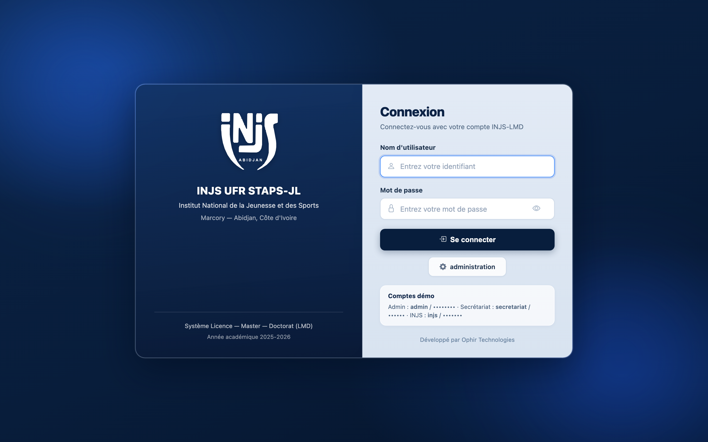

*Figure 1 — Écran de connexion. ① Le bloc de gauche présente l'institution ;
② le formulaire de connexion ; ③ l'année académique courante.*

En cas de double authentification (MFA), un second écran vous demande un code à
six chiffres envoyé sur votre téléphone ou votre messagerie sécurisée.

## 2.4 Changer de mot de passe

Un changement de mot de passe peut être **imposé** lors de la première connexion
ou par un administrateur. Dans ce cas l'application vous dirige vers un écran
dédié avant de vous laisser accéder au reste du système.

Pour changer volontairement votre mot de passe par la suite :

1. Cliquez sur votre **nom**, en haut à droite de l'écran.
2. Choisissez **Mon profil**.
3. Faites défiler jusqu'à la section **Sécurité**.
4. Saisissez votre mot de passe actuel, puis le nouveau et sa confirmation.
5. Cliquez sur **Enregistrer**.

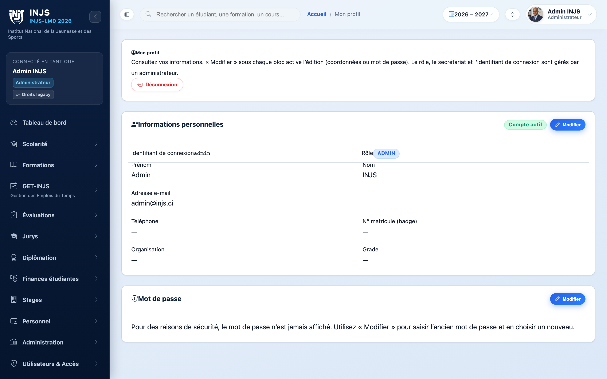

*Figure 2 — L'écran **Mon profil** regroupe vos informations personnelles et les
réglages de sécurité de votre compte.*

## 2.5 Se déconnecter

Cliquez sur votre nom, en haut à droite, puis sur **Se déconnecter**. Pensez à le
faire systématiquement sur un poste partagé.

## 2.6 Session expirée

Après une période d'inactivité, la session se ferme. L'application vous ramène à
l'écran de connexion et vos données non enregistrées peuvent être perdues :
**enregistrez avant toute pause**.

## 2.7 Dépannage d'accès

| Symptôme | Cause probable | Solution |
|----------|----------------|----------|
| « Identifiant ou mot de passe incorrect » | Identifiant mal saisi, mot de passe erroné ou compte désactivé | Vérifiez la casse du clavier, réessayez, puis contactez l'administrateur |
| « Votre session a expiré » | Inactivité prolongée | Reconnectez-vous et recommencez l'opération |
| « Vous n'avez pas les droits suffisants » | Votre profil ne permet pas cette action | Consultez le chapitre 3 et adressez votre demande à l'administrateur |
| Page blanche après connexion | Cache du navigateur obsolète | Videz le cache (Ctrl+Maj+R ou Cmd+Maj+R) et rechargez |
| « Le service est indisponible » | Serveur arrêté ou réseau interrompu | Vérifiez le réseau, patientez, puis contactez le support DSI |
| Code MFA non reçu | Code expiré ou mauvais canal | Demandez un nouveau code ; s'il échoue, contactez l'administrateur |

---
- Une capture est signalée par la mention *Figure n*, suivie de sa légende.
- Les repères **①②③** sur une capture indiquent les zones commentées dans le texte.

# 3. Profils, rôles et droits

## 3.1 Les douze rôles

L'institution emploie **douze profils**. Votre rôle détermine les écrans qui
s'affichent dans la barre latérale et les actions que vous pouvez effectuer.

| Code | Libellé affiché | Périmètre principal |
|------|------------------|---------------------|
| `ADMIN` | Administrateur | Accès complet à toutes les fonctions |
| `DIRECTION` | Direction | Pilotage institutionnel, finance et statistiques globales |
| `CHEF_INJS_ADMIN` | Chef INJS Admin | Accès complet à toutes les fonctions |
| `INJS_ADMIN` | INJS Admin | Accès complet à toutes les fonctions |
| `CHEF_SECRETARIAT` | Chef Secrétariat | Scolarité, utilisateurs et formations (niveau N3) |
| `SECRETARIAT` | Secrétariat | Scolarité, inscriptions, groupes, documents (niveau N2) |
| `FINANCE` | Finance | Finances étudiantes et paramétrage ; accueil redirigé vers la finance |
| `ARCHIVE` | Archiviste | Consultation, archives, graduation et statistiques |
| `ENCADRANT` | Encadrant | Emplois du temps, présences, encadrés et groupes pédagogiques |
| `SUPERVISEUR` | Superviseur | Suivi d'assiduité ; vue évaluations dédiée |
| `FORMATEUR` | Formateur | **Application mobile** : badgeage et saisie |
| `AUDITEUR` | Étudiant | **Application mobile** : badgeage et consultation |

> **Formateur et Étudiant n'utilisent pas ce site web.** Ces deux profils sont
> réservés à l'application mobile. Ils s'y connectent avec le même compte.

## 3.2 Ce que chaque rôle voit

| Domaine | Rôles autorisés |
|---------|-----------------|
| Tableau de bord LMD | Administrateur, Direction, Chef INJS Admin, INJS Admin, Chef Secrétariat, Secrétariat, Encadrant |
| Scolarité (14 écrans) | Secrétariat, Chef Secrétariat, Archiviste, encadrement, Direction |
| Formations LMD | Encadrement, Secrétariat, Archiviste, supervision |
| Emplois du temps (10 écrans) | Encadrant, supervision, Secrétariat, encadrement, Direction |
| Évaluations (7 écrans) | Secrétariat, encadrement, Archiviste, encadrement de direction |
| Jurys (5 écrans) | Secrétariat, encadrement, Archiviste, supervision |
| Diplômation (6 écrans) | Archiviste, Secrétariat, encadrement, Direction |
| Finances étudiantes (11 écrans) | Finance, Direction, Archiviste |
| Stages (5 écrans) | Secrétariat, encadrement, Archiviste, encadrement de direction |
| Personnel (5 écrans) | Encadrement, Secrétariat, Archiviste, supervision, Direction |
| Administration (9 écrans) | Archiviste, Secrétariat, encadrement, Direction |
| Utilisateurs & Accès (12 écrans) | Administrateur, Direction, Chef INJS Admin, INJS Admin, Chef Secrétariat, Secrétariat |
| Statistiques (9 écrans) | Administrateur, Direction, Chef INJS Admin, INJS Admin, Chef Secrétariat, Secrétariat, Finance, Archiviste, Encadrant |
| Référentiels (12 écrans) | Administrateur, Direction, Chef INJS Admin, INJS Admin, Chef Secrétariat, Secrétariat |
| Audit (5 écrans) | Administrateur, Direction, Chef INJS Admin, INJS Admin, Archiviste |

## 3.3 « Si vous êtes… allez sur… »

| Si vous êtes… | Commencez par | Puis votre quotidien porte sur |
|----------------|----------------|---------------------------------|
| **Administratrice** | Tableau de bord | Chapitre 15 (comptes et habilitations), chapitre 18 (audit) |
| **Direction** | Tableau de bord | Chapitre 16 (statistiques), chapitre 11 (finances), chapitre 9 (jurys) |
| **Secrétaire** | Scolarité | Chapitre 5 (candidatures), chapitre 6 (formations et inscriptions) |
| **Service financier** | Tableau de bord finance | Chapitre 11 : frais, paiements, ajustements, situation |
| **Archiviste** | Archives | Chapitre 10 (diplômation), chapitre 12 (archives) |
| **Encadrant** | Emplois du temps | Chapitre 7 (EDT), chapitre 8 (présences) |
| **Superviseur** | Tableau de bord | Chapitre 8 (assiduité), chapitre 9 (évaluations) |
| **Formateur** | Application mobile | Chapitre 7 : badgeage d'une séance par QR |
| **Étudiant** | Application mobile | Chapitre 7 : badgeage et historique de présence |

---

## 3.4 Comment l'application décide de ce qu'elle affiche

L'interface n'accorde jamais rien : elle **masque** une entrée dont vous ne
détenez pas le droit. Trois sources sont évaluées dans cet ordre :

1. **Vos permissions effectives** si votre compte est gouverné par le référentiel
   des habilitations ;
2. **Vos capacités**, calculées par le serveur à partir de votre rôle ;
3. **Votre rôle**, en secours, le temps que les capacités se chargent.

> **À savoir.** Masquer une entrée ne change aucune décision du serveur, et
> l'afficher ne vous dispense d'aucun contrôle. Une URL saisie à la main dans la
> barre d'adresse ne contourne pas ce filtre : le garde de route applique le même
> index que le menu. Si un écran manque alors que vous pensez y avoir droit,
> c'est que le droit n'est pas attribué : contactez l'administrateur.

## 3.5 Consulter ses droits

1. Cliquez sur votre nom, en haut à droite.
2. Choisissez **Mon profil**.
3. La section **Droits** récapitule les permissions qui vous sont accordées.

Vous pouvez également consulter la vue d'ensemble des droits dans
**Utilisateurs & Accès → Permissions**.

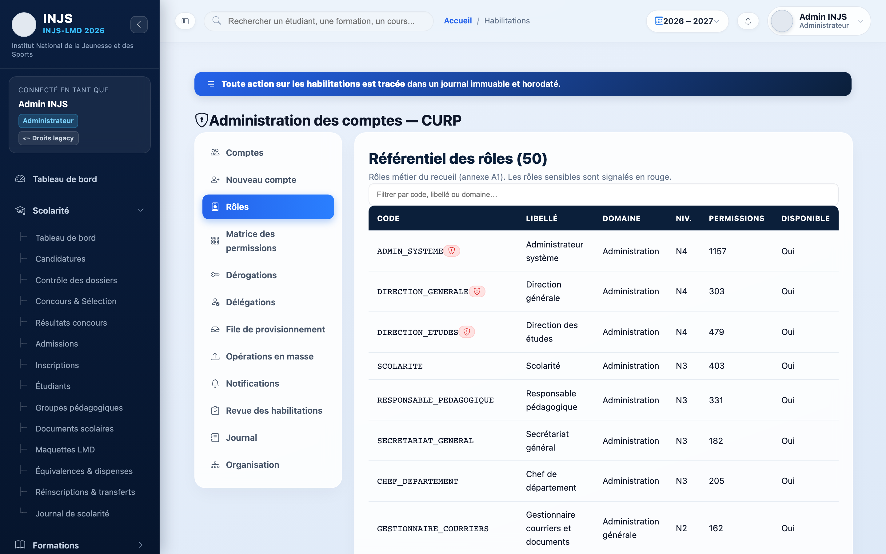

*Figure 3 — L'écran **Comptes utilisateurs** : la liste des comptes de l'institution
et leurs rôles. Réservé aux profils d'administration.*

## 3.6 Cas pratique — vérifier ses droits effectifs

**Contexte.** Vous êtes **Secrétaire** et vous souhaitez savoir si vous pouvez
consulter les statistiques.

1. Connectez-vous avec votre compte.
2. Regardez la barre latérale : la section **Statistiques** est-elle visible ?
3. Si elle l'est, ouvrez-la : les écrans **Candidatures**, **Admissions**,
   **Inscriptions**, **Effectifs**, **Résultats**, **Finances**, **Rapports** et
   **Alertes & seuils** sont autant de tests de votre droit de consultation.
4. Si un écran est absent, votre rôle ne vous accorde pas ce droit.

# 4. L'interface générale

Ce chapitre est votre référence pour comprendre la disposition de l'application.
Tous les modules du manuel reprennent cette structure.

## 4.1 La barre latérale ①

Située à gauche, elle regroupe les modules par thème. Un clic sur un intitulé
déplie ses sous‑menus ; un second clic le replie. Seuls les modules que vous êtes
autorisé à utiliser apparaissent : une section disparaît entièrement si aucun de
ses enfants ne vous est accessible.

*Figure 4 — Le tableau de bord : ① barre latérale ; ② barre de recherche ;
③ fil d'Ariane ; ④ sélecteur d'année académique ; ⑤ cloche de notifications ;
⑥ compte connecté.*

## 4.2 La barre supérieure ② ③ ④ ⑤ ⑥

| Zone | Élément | Usage |
|------|---------|-------|
| ② | Barre de recherche | Recherche transversale d'un étudiant, d'une formation, d'un cours |
| ③ | Fil d'Ariane | Remonte le chemin de navigation ; chaque étape est cliquable |
| ④ | Sélecteur d'année académique | Bascule entre deux années ; **il pilote l'affichage de toute la page** |
| ⑤ | Cloche de notifications | Alertes de l'application (validations, tâches, anomalies) |
| ⑥ | Compte connecté | Nom, rôle, accès à **Mon profil** et à la déconnexion |

> **Point de vigilance — l'année académique.** Beaucoup d'écrans semblent « vides »
> parce que vous consultez la mauvaise année. Vérifiez toujours le sélecteur ④
> avant de conclure qu'une donnée est manquante.

## 4.3 Les quatre zones d'un écran

Presque tous les écrans respectent la même disposition :

1. **Bandeau de titre** — nom du module et contexte (année, formation, période).
2. **Indicateurs** — quelques chiffres clés pour orienter le travail.
3. **Zone de recherche et de filtres** — pour restreindre la liste.
4. **Tableau** — les lignes de données, avec une action par ligne.

## 4.4 Les boutons d'action

| Aspect | Bouton bleu | Bouton blanc | Bouton « Ouvrir » |
|--------|-------------|--------------|-------------------|
| Signification | Action principale, constructive | Action secondaire, non destructive | Accéder au détail d'une ligne |
| Exemples | **Nouvelle candidature**, **Enregistrer** | **Annuler**, **Fermer**, **Émarger** | **Ouvrir**, **Voir** |

## 4.5 Les confirmations

Toute action qui modifie ou supprime des données demande confirmation. Lisez
toujours le message : il précise **ce qui** sera touché et **combien**
d'éléments. Une confirmation qui annonce « 18 dossiers seront supprimés » n'est
jamais anodine : vérifiez les filtres appliqués avant de valider.

Les actions les plus sensibles (archivage, suppression, décision de jury) sont
doublées d'une seconde confirmation. Ne la contournez pas.

## 4.6 La pagination et le tri

Les listes longues sont paginées. En bas de tableau : les **flèches** changent de
page ; un sélecteur indique **combien de lignes** afficher par page ; le sélecteur
de lignes affiche **les lignes sélectionnées**, à cocher pour appliquer une action
groupée.

Les en-têtes de colonnes sont cliquables : un clic trie par ordre croissant, un
second clic inverse l'ordre.

## 4.7 Exporter une liste

La plupart des écrans proposent une exportation. Trois règles :

1. **Vérifiez les filtres avant d'exporter** : le fichier ne contient que ce que
   l'écran affiche. Un export sans filtre peut porter sur plusieurs milliers de lignes.
2. **Taillez le fichier** : privilégiez l'export d'un périmètre précis (une
   formation, un mois) plutôt qu'une année entière.
3. **Rangez le fichier** : les exports contiennent des données nominatives. Voir
   le chapitre 22 sur la confidentialité.

## 4.8 Badges de statut

| Couleur | Signification usuelle |
|---------|-----------------------|
| Vert | Validé, admissible, payé, présent |
| Bleu | En cours, planifié, en attente |
| Orange | Attention, incomplet, à vérifier |
| Rouge | Refusé, en échec, bloqué |
| Gris | Archivé, clôturé, sans effet |

## 4.9 Cas pratique — retrouver un écran en moins de trente secondes

**Contexte.** Vous cherchez l'écran qui permet de consulter la situation financière
d'un étudiant.

1. Lisez votre module de rattachement dans la barre latérale, par exemple
   **Finances étudiantes**.
2. Survolez les entrées, qui portent leur nom exact : **Frais de scolarité**,
   **Factures**, **Paiements**, **Reçus**, **Bourses & remboursements**,
   **Situation financière**.
3. Cliquez sur **Situation financière**.
4. Vérifiez dans le fil d'Ariane (③) que vous êtes au bon endroit.

**Résultat attendu.** L'écran s'ouvre en moins de trente secondes, sans avoir à
parcourir l'arborescence entière.

---
**Résultat attendu.** Vous savez exactement quels modules sont ouverts à votre
profil, sans tester chaque écran un par un.

**Erreur à éviter.** Invoquer « l'écran n'apparaît pas » comme une panne : c'est
presque toujours une question de droits, à régler auprès de l'administrateur.

# 5. Scolarité et admissions

## 5.1 À quoi sert ce domaine

Ce domaine suit l'étudiant **de la candidature au diplôme** : dépôt du dossier,
contrôle des pièces, sélection, admission, puis inscription administrative.

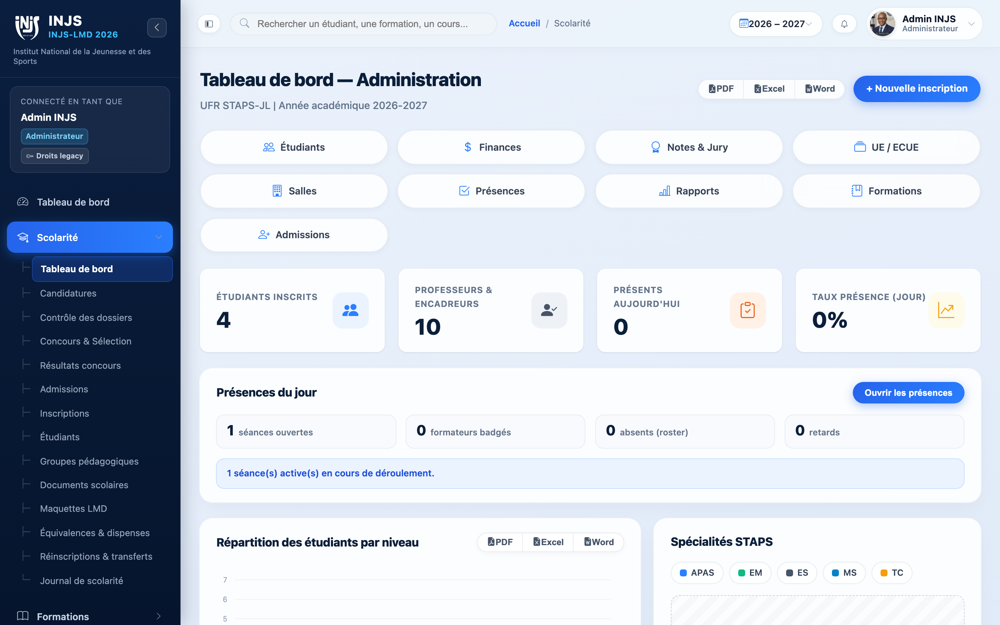

*Figure 5 — Tableau de bord Scolarité : ① indicateurs (dossiers reçus, dossiers
complets, en cours de traitement, admis) ; ② barre de recherche ; ③ filtre de
statut ; ④ table des dossiers avec la barre de complétion.*

## 5.2 Qui peut y accéder

| Écran | Rôles autorisés |
|-------|-----------------|
| Tableau de bord Scolarité | Secrétariat, Chef Secrétariat, encadrement, Archiviste, Direction |
| Candidatures, Contrôle des dossiers | Secrétariat, Chef Secrétariat, encadrement |
| Concours & Sélection, Résultats concours | Secrétariat, encadrement, Direction |
| Admissions, Inscriptions | Secrétariat, Chef Secrétariat, encadrement |
| Étudiants, Groupes pédagogiques | Secrétariat, Archiviste, Encadrant, encadrement |
| Documents scolaires | Secrétariat, Chef Secrétariat, Archiviste |
| Maquettes LMD | encadrement, Archiviste |
| Équivalences & dispenses | Secrétariat, encadrement, Archiviste |
| Réinscriptions & transferts | Secrétariat, Chef Secrétariat, Direction |
| Journal de scolarité | Secrétariat, Archiviste, encadrement |

## 5.3 Comment y accéder

Barre latérale → **Scolarité** → choisissez l'entrée :

| Entrée de menu | Écran |
|----------------|-------|
| Tableau de bord | Vue d'ensemble du parcours des dossiers |
| Candidatures | Dossiers de candidature et pièces justificatives |
| Contrôle des dossiers | Vérification et validation des pièces déposées |
| Concours & Sélection | Campagnes de concours et épreuves |
| Résultats concours | Classement des candidats, calcul et publication |
| Admissions | Décisions d'admission des candidats |
| Inscriptions | Inscriptions administratives de l'année |
| Étudiants | Dossiers étudiants et formations suivie |
| Groupes pédagogiques | Constitution des groupes et effectifs |
| Documents scolaires | Listes, attestations et documents d'inscription |
| Maquettes LMD | Structure pédagogique d'une formation |
| Équivalences & dispenses | Dispenses et équivalences d'unités |
| Réinscriptions & transferts | Réinscriptions, transferts et réorientations |
| Journal de scolarité | Historique des événements de scolarité |

## 5.4 L'écran Candidatures, zone par zone

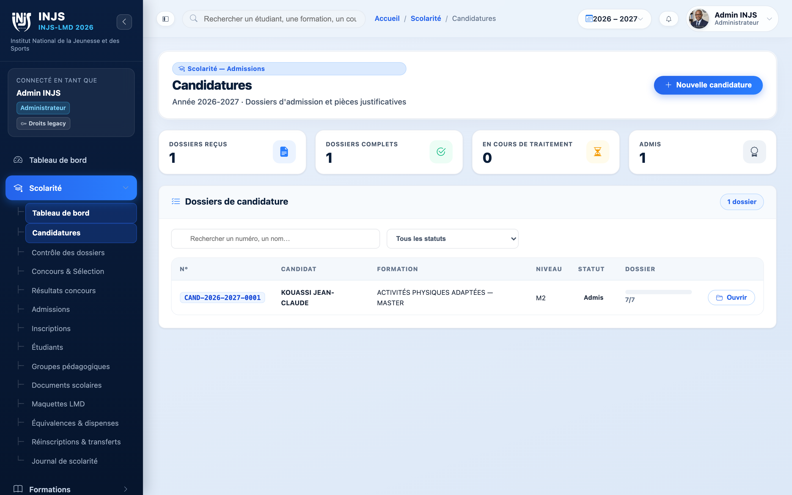

*Figure 6 — Écran **Candidatures**. ① Indicateurs : dossiers reçus, complets, en
traitement, admis. ② Barre de recherche par numéro ou nom. ③ Filtre de statut.
④ Colonne **Dossier** : barre de progression 7/7 pièces. ⑤ Bouton **Ouvrir**.*

Le numéro de dossier suit le format `CAND-AAAA-AAAA-NNNN` : il est attribué
automatiquement et sert d'identifiant de badgeage. Un dossier est **complet**
lorsque toutes les pièces obligatoires sont déposées et validées.

## 5.5 Actions disponibles

| Action | Comment faire | Rôle | Effet | Annulable ? |
|--------|---------------|------|-------|-------------|
| Créer une candidature | Bouton **Nouvelle candidature** | Secrétariat, encadrement | Ouvre un dossier vierge | Oui, tant qu'il est vide |
| Ouvrir un dossier | Bouton **Ouvrir** | Tous | Affiche le dossier et ses pièces | — |

## 5.6 Formulaires et champs

| Champ | Obligatoire | Format | Valeurs | Astuce |
|-------|-------------|--------|---------|---------|
| Numéro de dossier | Auto | `CAND-AAAA-AAAA-NNNN` | — | Ne le modifiez pas : il identifie le badgeage |
| Nom et prénom | Oui | Texte | — | Saisissez exactement les pièces d'identité |
| Date de naissance | Oui | `JJ/MM/AAAA` | — | L'âge conditionne l'éligibilité à certaines formations |
| Formation demandée | Oui | Liste | Formations ouvertes | Filtrez par année pour éviter les formations closes |
| Niveau | Oui | Liste | L1, L2, L3, M1, M2, M3, Doctorat | Le niveau découle souvent de la formation |
| Pièce justificative | Oui | `.pdf`, `.jpg`, `.png` | — | Scannez lisiblement : une pièce illisible est rejetée |
| Justification | Conditionnel | Texte | — | Obligatoire pour toute **décision manuelle** |
| Déposer une pièce | Onglet des pièces, **Ajouter** | Secrétariat | Attache un justificatif au dossier | Oui |
| Valider une pièce | Bouton de validation sur la pièce | Secrétariat, encadrement | La pièce devient vérifiée | Oui |
| Ouvrir une campagne | **Concours & Sélection** → **Ouvrir** | Secrétariat | Détaille épreuves et candidats | — |
| Calculer le classement | **Résultats concours** → **Calculer le classement** | Secrétariat, Direction | Produit le rang de chaque candidat | Oui (recalculable) |
| Publier le classement | **Publier** | Direction | Rend le classement visible et opposable | Non |
| Valider une admission | **Admissions** → valider la candidature | Secrétariat, Direction | Transforme le candidat en admis | Oui |
| Inscrire un étudiant | **Inscriptions** → **Nouvelle inscription** | Secrétariat | Crée l'inscription administrative | Oui (retrait possible) |

## 5.7 Filtres, recherche et exports

| Écran | Filtres disponibles |
|-------|--------------------|
| Candidatures | Recherche par numéro ou nom ; statut du dossier |
| Concours & Sélection | Statut de la campagne, formation, année académique |
| Résultats concours | Campagne, admissible ou non |
| Journal de scolarité | Période, type d'événement |

Les exports produisent un fichier `.xlsx` reprenant **exactement** le périmètre
filtré. Un export du module Scolarité contient des données nominatives : voir le
chapitre 22.

---

## 5.8 Cas pratique — enregistrer une candidature complète

**Contexte.** Un candidat souhaite être admis en Master 2.
**Données d'entrée** : `DIALLO Amadou`, né le `14/03/2001`, formation
**Master — Activités Physiques Adaptées**.

1. Barre latérale → **Scolarité** → **Candidatures**.
2. Cliquez sur **Nouvelle candidature**.
3. Saisissez l'identité : nom `DIALLO`, prénom `Amadou`, date `14/03/2001`.
4. Choisissez la formation **Master — Activités Physiques Adaptées**
   et le niveau `M2`.
5. Déposez les pièces : carte d'identité, diplôme, relevés, attestation.
6. Enregistrez. Le numéro `CAND-2026-2027-0001` est attribué.
7. Ouvrez **Contrôle des dossiers** et validez chaque pièce.
8. Vérifiez que la barre du dossier affiche `7/7`.

**Résultat attendu.** Le dossier apparaît avec la mention **complet** et devient
traitable aux étapes suivantes.

**Contrôle de conformité.** La date de naissance est cohérente avec le niveau
visé ; toutes les pièces obligatoires sont marquées validées.

**Erreur à éviter.** Créer deux fois le même dossier pour corriger une faute :
créez un doublon impossible à dédoublonner. Corrigez la fiche existante.

## 5.9 Erreurs fréquentes et solutions

| Erreur | Cause | Solution |
|--------|-------|----------|
| « Numéro de dossier déjà utilisé » | Collision de saisie manuelle | Laissez le numéro s'attribuer automatiquement |
| La pièce est rejetée | Fichier illisible ou format non accepté | Scannez à 300 dpi et utilisez `.pdf`, `.jpg` ou `.png` |
| Le classement ne se calcule pas | Épreuves incomplètes | Complétez les notes de toutes les épreuves de la campagne |
| La décision est refusée | Champ **justification** vide | Renseignez une justification explicite : elle est obligatoire |

## 5.10 Bonnes pratiques

- Vérifiez **l'année académique** avant toute saisie : un dossier créé sur la
  mauvaise année est invisible dans les statistiques.
- Renseignez le champ **justification** dès qu'une décision est prise
  manuellement : il est exigé et archivé.
- Traitez **Contrôle des dossiers** comme une file : traitez d'abord les dossiers
  complets, pour libérer rapidement les admissions.
- Exportez avant une journée de saisie massive : une référence de contrôle vous
  permet de reprendre après une interruption.

# 6. Formations et référentiels pédagogiques

## 6.1 À quoi sert ce domaine

Ce domaine décrit **ce que l'on enseigne** : hiérarchie des formations, structure
pédagogique LMD, volumes horaires et affectation des enseignants.

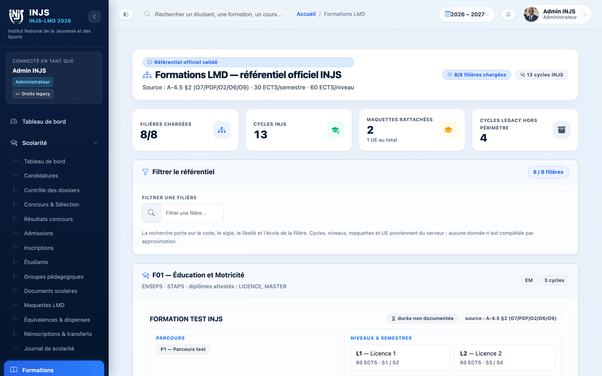

*Figure 7 — Écran **Formations LMD** : la liste des formations avec leurs niveaux,
semestres et effectifs.*

## 6.2 Qui peut y accéder

Administrateur, Direction, Chef INJS Admin, INJS Admin, Chef Secrétariat,
Secrétariat, Archiviste, Encadrant, Superviseur.

## 6.3 Comment y accéder

Barre latérale → **Formations** :

| Entrée de menu | Contenu |
|----------------|---------|
| Formations LMD | Liste des formations (Licence, Master, Doctorat) |
| Filières | Grands ensembles de formations |
| Parcours | Orientations au sein d'une filière |
| Niveaux | L1 à Doctorat |
| Semestres | Découpage des années |
| UE / ECUE | Unités et éléments constitutifs d'enseignement |
| Cours (LMD) | Cours et volumes horaires |
| Enseignants | Corps enseignant et formateurs |
| Affectations pédagogiques | Charge d'enseignement par enseignant |

## 6.4 L'écran Maquettes LMD, zone par zone

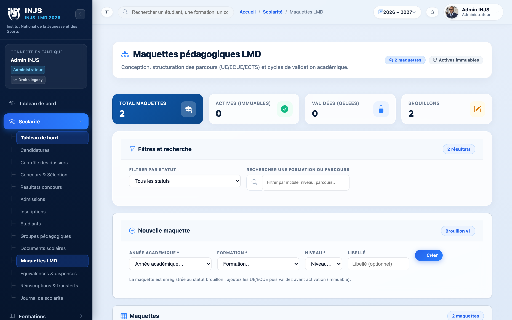

*Figure 8 — **Maquettes LMD** : la structure pédagogique d'une formation, avec ses
unités, ses ECUE et ses crédits.*

Une **maquette** est la structure officielle d'une formation : liste des UE,
ECUE, volumes horaires et crédits. Elle sert de référence aux emplois du temps et
au calcul des résultats : toute modification impacte les deux.

## 6.5 Actions disponibles

| Action | Comment faire | Rôle | Effet | Annulable ? |
|--------|---------------|------|-------|-------------|
| Créer une formation | **Formations LMD** → **Nouvelle formation** | Administrateur, Direction | Crée la formation | Oui |
| Ouvrir une formation | Bouton **Ouvrir** | Tous | Détaille maquette et étudiants | — |
| Ajouter une UE | Onglet UE, **Ajouter** | Administrateur, encadrement | Enrichit la maquette | Oui |
| Modifier un volume horaire | Champ `Volume horaire` de l'ECUE | Administrateur, encadrement | Change le volume retenu | Oui |
| Archiver un module | Action **Archiver** | Administrateur, Direction, Secrétariat | Le retire des listes actives | Oui (désarchivage) |
| Affecter un enseignant | **Affectations pédagogiques** | Administrateur, encadrement | Attribue une charge horaire | Oui |

## 6.6 Formulaires et champs

| Champ | Obligatoire | Format | Valeurs | Astuce |
|-------|-------------|--------|---------|---------|
| Intitulé de la formation | Oui | Texte | — | Reprenez l'intitulé officiel du diplôme |
| Niveau | Oui | Liste | L1…Doctorat | Détermine le semestre de rattachement |
| Filière / Parcours | Oui | Liste | Référentiels | Créez-les d'abord au chapitre 17 |
| Volume horaire | Oui | Nombre | Décimales admises | Le total doit correspondre à la maquette officielle |
| Crédits ECTS | Oui | Nombre entier | — | La somme conditionne la validation |
| Enseignant affecté | Oui | Liste | Enseignants actifs | Un enseignant ne peut pas porter deux fois la même UE |

## 6.7 Filtres, recherche et exports

Filtres par **niveau**, **filière**, **semestre** et **année académique**.
Les volumes horaires sont exportables en `.xlsx` pour confrontation avec la
maquette officielle.

## 6.8 Cas pratique — vérifier la maquette d'une formation

**Contexte.** Vous devez confirmer qu'une formation de Licence 1 totalise bien
**600 heures** sur l'année.

1. Barre latérale → **Formations** → **Formations LMD**.
2. Ouvrez la formation concernée.
3. Parcourez les UE et notez le volume horaire de chaque ECUE
   (par exemple `CM 30 h` + `TD 15 h` pour une UE à 45 h).
4. Additionnez les UE deux à deux : `45 + 60 = 105 h`, puis `50 + 40 = 90 h`,
   `30 + 25 = 55 h`, `15 + 20 = 35 h`… jusqu'à la maquette complète.
5. Contrôlez la somme des crédits : elle doit correspondre au barème LMD.

**Résultat attendu.** Le total horaire et le total des crédits concordent avec la
maquette officielle.

**Contrôle de conformité.** Comparez votre total à celui de la maquette
approuvée : tout écart doit être justifié par une délibération.

**Erreur à éviter.** Compter les UE sans vérifier les **crédits** : une maquette
peut avoir le bon volume horaire et des crédits faux.

## 6.9 Erreurs fréquentes et solutions

| Erreur | Cause | Solution |
|--------|-------|----------|
| « Aucune donnée à afficher » | Année académique ou filtre restrictif | Changez d'année (sélecteur ④) et effacez les filtres |
| Une formation n'apparaît pas | Année différente ou filtre actif | Changez d'année, effacez les filtres |
| Impossible d'ajouter un ECUE | UE parente archivée | Réactivez l'UE puis ajoutez l'ECUE |
| Volume horaire incohérent | Saisie sans contrôle de bornes | Vérifiez la maquette officielle avant d'enregistrer |
| Un enseignant est affecté deux fois | Affectation déjà existante | Modifiez l'affectation existante au lieu d'en créer une seconde |

## 6.10 Bonnes pratiques

- Ne modifiez jamais une maquette validée sans l'accord de la Direction : elle
  conditionne les emplois du temps et les résultats.
- Vérifiez la **somme des crédits** après chaque ajout d'UE.
- Exportez la maquette avant toute session de correction.

# 7. Emplois du temps (GET-INJS)

## 7.1 À quoi sert ce domaine

Ce module construit et affiche les **emplois du temps** : il affecte chaque cours
à un groupe, une salle, un enseignant et un créneau, en évitant les conflits.

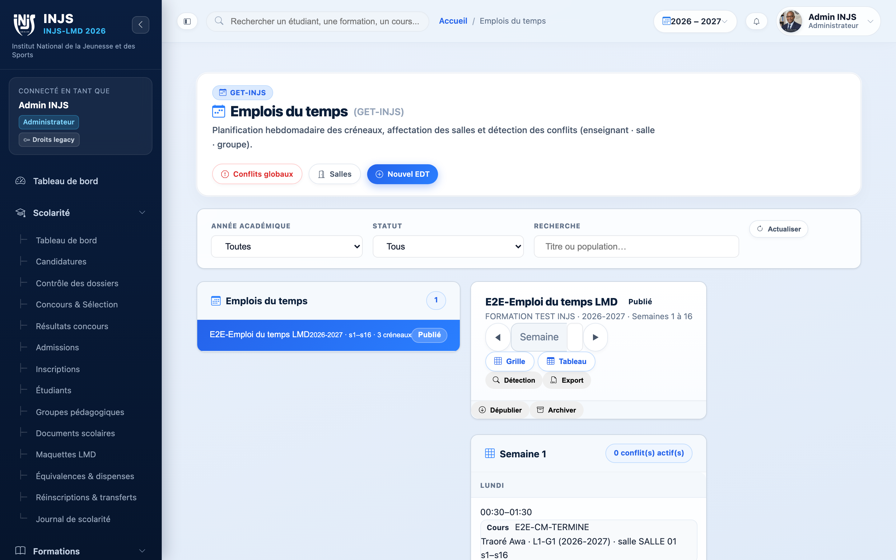

*Figure 9 — **Tableau des emplois du temps** : la grille hebdomadaire par jour et
par créneau horaire.*

## 7.2 Qui peut y accéder

Administrateur, Direction, Chef INJS Admin, INJS Admin, Chef Secrétariat,
Secrétariat, Archiviste, Encadrant, Superviseur.

## 7.3 Comment y accéder

Barre latérale → **GET-INJS** :

| Entrée de menu | Contenu |
|----------------|---------|
| Tableau des emplois du temps | Grille hebdomadaire consolidée |
| Créer un emploi du temps | Génération d'une nouvelle grille |
| Présences de séance (QR & émargement) | Pointage des présences d'une séance |
| Cours | Liste des cours à placer |
| Salles & espaces | Salles disponibles et leurs caractéristiques |
| Disponibilités | Créneaux où un enseignant est disponible |
| Conflits & contraintes | Conflits détectés à traiter |
| Rattrapages & examens | Séances de rattrapage et examens |
| Export / Impression | Extraction de l'emploi du temps |

## 7.4 L'écran Présences de séance, zone par zone

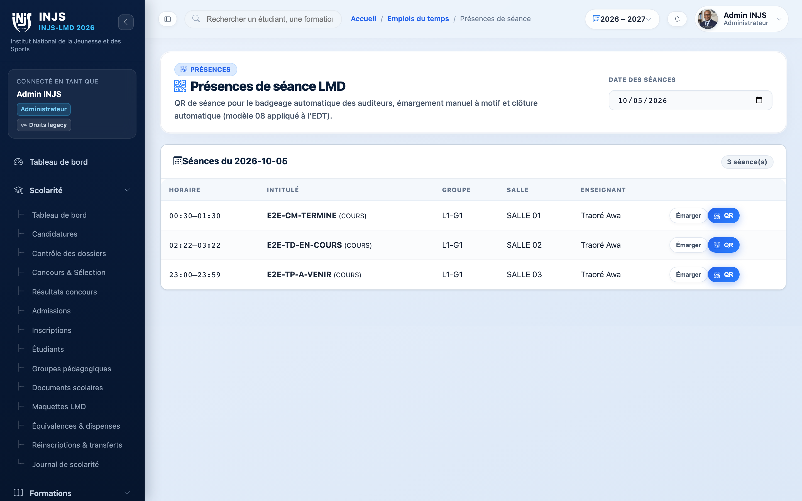

*Figure 10 — Écran **Présences de séance**. ① Sélecteur de date des séances ;
② tableau des séances du jour (horaire, intitulé, groupe, salle, enseignant) ;
③ bouton **Émarger** pour le pointage manuel ; ④ bouton **QR** qui affiche le
code à scanner par les étudiants.*

Chaque séance porte un code **QR** propre : il identifie la séance, le groupe et
la fenêtre horaire. Le scan par un étudiant enregistre sa présence sans
saisie manuelle.

## 7.5 Actions disponibles

| Action | Comment faire | Rôle | Effet | Annulable ? |
|--------|---------------|------|-------|-------------|
| Générer un emploi du temps | **Créer un emploi du temps** | Administrateur, Direction | Produit une grille complète | Oui (recréer) |
| Placer un cours | Sélectionner un cours et un créneau | Administrateur, encadrement | Crée la séance | Oui |
| Détecter les conflits | **Conflits & contraintes** | Encadrant, encadrement | Liste les incompatibilités | — |
| Déclarer une disponibilité | **Disponibilités** | Enseignant, encadrant | Autorise un créneau | Oui |
| Afficher le QR d'une séance | Bouton **QR** | Encadrant, encadrement | Affiche le code de badgeage | — |
| Émarger une séance | Bouton **Émarger** | Encadrant, encadrement | Ouvre la feuille de présence | Oui (correction) |
| Programmer un rattrapage | **Rattrapages & examens** | Encadrant, encadrement | Crée une séance de remplacement | Oui |

## 7.6 Formulaires et champs

| Champ | Obligatoire | Format | Valeurs | Astuce |
|-------|-------------|--------|---------|---------|
| Date de la séance | Oui | `JJ/MM/AAAA` | — | La séance appartient à un jour précis |
| Créneau horaire | Oui | `HH:MM–HH:MM` | — | Vérifiez l'horloge du serveur (voir chapitre 21) |
| Groupe | Oui | Liste | Groupes pédagogiques | Un groupe ne peut suivre qu'une séance à la fois |
| Salle | Oui | Liste | Salles & espaces | Contrôlez la **capacité** de la salle |
| Enseignant | Oui | Liste | Enseignants | Un enseignant ne peut donner deux cours simultanément |
| Intitulé du cours | Oui | Texte | — | Reprenez l'intitulé de l'ECUE |

## 7.7 Filtres, recherche et exports

Filtres par **semaine**, **groupe**, **salle** et **enseignant**. L'écran
**Export / Impression** produit un document prêt à diffuser aux étudiants et aux
enseignants.

## 7.8 Cas pratique — créer une séance et la pointer

**Contexte.** Vous devez placer le cours **E2E-TD-EN-COURS** du groupe `L1-G1`
le lundi, de `08:00` à `10:00`, en salle 2, avec un enseignant.

1. Barre latérale → **GET-INJS** → **Créer un emploi du temps**.
2. Choisissez le groupe `L1-G1` et la semaine voulue.
3. Sélectionnez le cours **E2E-TD-EN-COURS**.
4. Ciblez le créneau `08:00–10:00` du lundi.
5. Affectez la salle 2 et l'enseignant.
6. Enregistrez. Vérifiez qu'aucun conflit n'apparaît.
7. Le jour venu, ouvrez **Présences de séance** à la bonne date.
8. Cliquez sur **Émarger** et cochez les présents, ou affichez le **QR**.

**Résultat attendu.** La séance apparaît dans la grille et la feuille de présence

## 7.9 Erreurs fréquentes et solutions

| Erreur | Cause | Solution |
|--------|-------|----------|
| « Conflit d'horaire » | Deux cours sur le même créneau et le même enseignant ou salle | Déplacez l'un des deux cours ou changez de salle |
| « La salle est trop petite » | Capacité inférieure à l'effectif du groupe | Choisissez une salle de capacité supérieure |
| L'emploi du temps est vide | Aucune année académique sélectionnée | Vérifiez le sélecteur d'année (④) |
| Le QR ne s'affiche pas | Séance déjà clôturée ou date passée | Vérifiez la date de la séance puis réessayez |
| Les heures sont décalées | Décalage d'horloge sur le serveur | Signalez-le au support DSI (voir chapitre 21) |

## 7.10 Bonnes pratiques

- Vérifiez les **conflits** avant de publier une grille : une erreur d'emploi du
  temps se propage à toute l'année.
- Affichez le **QR** plutôt que d'émarger à la main : le pointage est plus rapide
  et la trace est automatique.
- Placz les cours majeurs en priorité : ils structuralent la semaine.
- Imprimez la grille hebdomadaire pour les enseignants.

# 8. Présences, assiduité et badgeage

## 8.1 À quoi sert ce domaine

Ce module **constate les présences** des étudiants, par émargement manuel ou par
badgeage QR depuis l'application mobile, et en tire les taux d'assiduité.

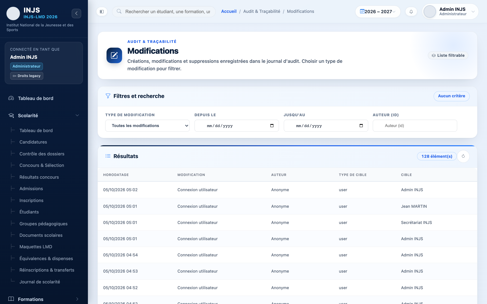

*Figure 11 — Le pointage d'une séance : émargement manuel et code QR de badgeage,
puis clôture de la séance.*

## 8.2 Qui peut y accéder

| Action | Rôles autorisés |
|--------|-----------------|
| Consulter les présences | Administrateur, Direction, Chef INJS Admin, INJS Admin, Chef Secrétariat, Secrétariat, Archiviste, Encadrant |
| Pointer ou clôturer une séance | Administrateur, Direction, encadrement, Secrétariat |
| Superviser l'assiduité | Superviseur, encadrement |
| Badger (mobile) | Formateur, Étudiant |

## 8.3 Les deux modes de pointage

| Mode | Qui agit | Avantage | Limite |
|------|----------|----------|--------|
| **Émargement** | L'enseignant coche la liste | Reste possible sans smartphone | Saisie manuelle, plus lente |
| **Badgeage QR** | L'étudiant scanne le code de la séance | Rapide, horodaté, géolocalisé | Nécessite un smartphone chargé |

Les deux modes alimentent le **même relevé** : vous pouvez panacher selon la séance.

## 8.4 Cas d'une séance à forte affluence

Sur une séance de `120` étudiants, l'émargement manuel demande environ `10`
minutes. Le badgeage QR ramène l'opération à **moins d'une minute**, chaque
étudiant scannant en quelques secondes.

## 8.5 Actions disponibles

| Action | Comment faire | Rôle | Effet | Annulable ? |
|--------|---------------|------|-------|-------------|
| Ouvrir la feuille d'émargement | Bouton **Émarger** | Enseignant, encadrant | Affiche la liste des inscrits | — |
| Pointer un étudiant | Cocher la case | Enseignant, encadrant | Enregistre une présence | Oui |
| Clôturer la séance | Bouton **Clôturer** | Enseignant, encadrant | Fige les présences de la séance | Non (demander une correction) |
| Afficher le QR | Bouton **QR** | Enseignant, encadrant | Affiche le code de la séance | — |
| Justifier une absence | Fiche de l'étudiant, motif | Encadrant, Secrétariat | Motive l'absence | Oui |
| Programmer un rattrapage | **Rattrapages & examens** | Encadrant | Crée une séance de remplacement | Oui |
| Consulter un taux de présence | Statistiques → Présences | Superviseur, encadrement | Produit le taux par groupe | — |

## 8.6 Le badgeage mobile en pratique

1. L'enseignant ouvre **Présences de séance** à la date du jour.
2. Il clique sur **QR** : le code s'affiche en plein écran.
3. L'étudiant ouvre l'application mobile, choisit **Badger** et scanne le code.
4. La présence est enregistrée avec l'heure ; l'application vérifie la
   **géofence** : un scan hors du périmètre autorisé est refusé.
5. L'étudiant peut scanner **hors connexion** : l'enregistrement est mis en file
   et synchronisé dès que le réseau revient.

> **À savoir.** Un scan refusé pour géofence n'est pas une panne : cela signifie
> que l'étudiant se trouve hors de l'enceinte autorisée. L'enseignant décide
> alors d'émarger manuellement.

## 8.7 Cas pratique — séance avec badgeage et émargement

**Contexte.** Séance de `85` étudiants ; 60 scoreront par QR, 25 seront émargés
manuellement.

1. Ouvrez **GET-INJS → Présences de séance** à la date du jour.
2. Affichez le **QR** pendant l'appel.
3. Après cinq minutes, basculez sur **Émarger** et cochez les présents restants.
4. Vérifiez le total : `60 + 25 = 85` étudiants pointés.
5. **Clôturez** la séance : les présences sont figées.

**Résultat attendu.** La séance est clôturée avec `85` pointages horodatés.

**Contrôle de conformité.** Le total pointé doit être égal ou inférieur à
l'effectif du groupe ; un écart signale un pointage erroné.

**Erreur à éviter.** Clôturer la séance avant la fin du cours : toute présence
ultérieure exige une demande de correction.

## 8.8 Erreurs fréquentes et solutions

| Erreur | Cause | Solution |
|--------|-------|----------|
| Le scan QR est refusé | Hors de la zone de géofence | Faites émarger l'étudiant manuellement |
| Les badges ne se synchronisent pas | Appareil hors ligne | Rouvrez l'application une fois le réseau revenu |
| Un pointage est manquant | Oubli pendant l'appel | Demandez la réouverture de la séance avant clôture |
| La séance n'apparaît pas | Mauvaise date ou année | Changez la date et vérifiez l'année (④) |
| Le taux de présence est faux | Séances non clôturées | Clôturez les séances : seules les clôturées sont consolidées |

## 8.9 Bonnes pratiques

- **Clôturez** vos séances le jour même : les taux d'assiduité ne sont fiables
  que sur des séances fermées.
- Affichez le QR **en début de séance**, jamais à la fin.
- En cas de doute sur un pointage, signalez avant clôture : après, la
  correction est formalisée.
- Consultez le taux de présence par groupe avant chaque jury : il éclaire les
  résultats.

# 9. Évaluations, notes et résultats

## 9.1 À quoi sert ce domaine

Ce module gère les **évaluations** (questionnaires et notes), la saisie, le
contrôle, le calcul des moyennes et la publication des résultats.

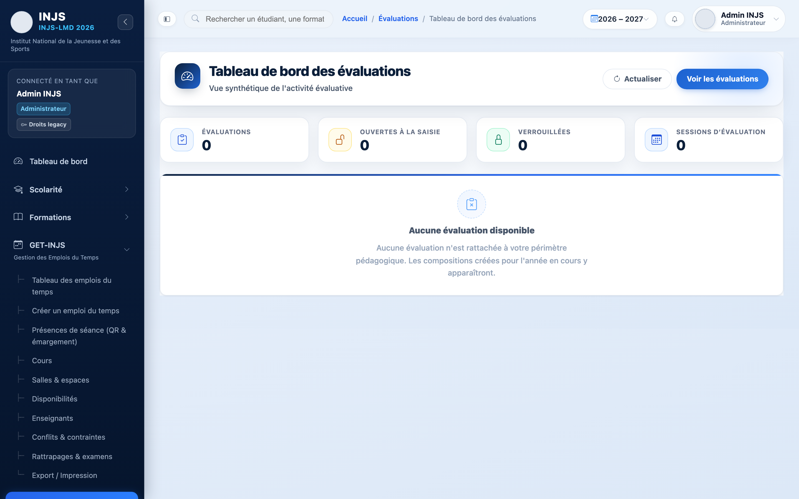

*Figure 12 — **Tableau de bord des évaluations** : suivi des questionnaires, des
saisies de notes et des contrôles en attente.*

## 9.2 Qui peut y accéder

Administrateur, Direction, Chef INJS Admin, INJS Admin, Chef Secrétariat,
Secrétariat, Archiviste, Encadrant, Superviseur.

## 9.3 Comment y accéder

Barre latérale → **Évaluations** :

| Entrée de menu | Contenu |
|----------------|---------|
| Tableau de bord des évaluations | Vue d'ensemble des évaluations |
| Évaluations | Liste des questionnaires et examens |
| Saisie des notes | Saisie par l'enseignant |
| Contrôle des notes | Vérification avant validation |
| Délibérations | Décisions pédagogiques |
| Résultats | Moyennes et publication |
| Relevés de notes | Relevés par étudiant |

## 9.4 L'écran Saisie des notes, zone par zone

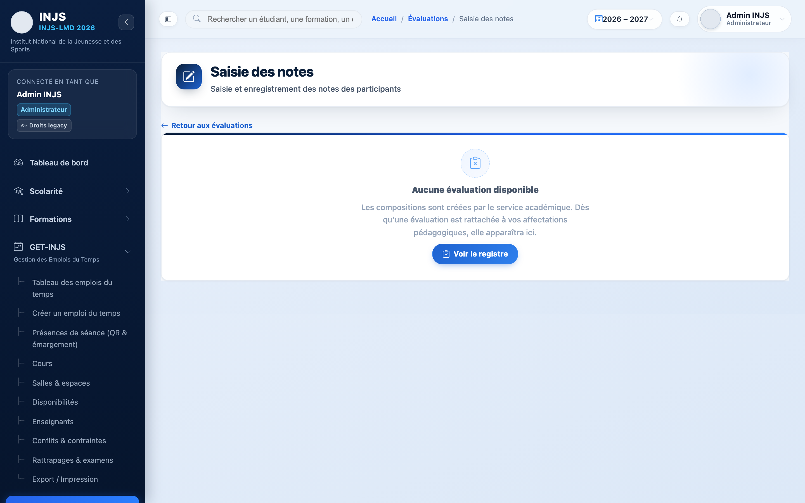

*Figure 13 — **Saisie des notes** : la grille des étudiants et la colonne de note,
avec les actions de validation.*

## 9.5 Actions disponibles

| Action | Comment faire | Rôle | Effet | Annulable ? |
|--------|---------------|------|-------|-------------|
| Créer un questionnaire | **Évaluations** → **Nouveau** | Administrateur, encadrement | Crée l'évaluation | Oui |
| Saisir une note | Grille de saisie, colonne note | Enseignant, encadrant | Enregistre la note | Oui avant clôture |
| Valider une note | Action de validation sur la ligne | Encadrant | Fige la note | Oui (correction motivée) |
| Calculer les moyennes | **Résultats** → **Calculer** | Secrétariat, Direction | Produit les moyennes par ECUE | Oui (recalcul) |
| Publier les résultats | **Publier** | Direction | Rend les résultats visibles | Non |
| Éditer un relevé | **Relevés de notes** | Secrétariat, Archiviste | Produit le relevé d'un étudiant | — |

## 9.6 Formulaires et champs

| Champ | Obligatoire | Format | Valeurs | Astuce |
|-------|-------------|--------|---------|---------|
| Intitulé de l'évaluation | Oui | Texte | — | Reprenez l'intitulé de l'ECUE |
| ECUE concerné | Oui | Liste | ECUE de la formation | Une note se rattache à un seul ECUE |
| Note | Oui | `0` à `20`, deux décimales | — | Une note hors borne est refusée |
| Absent | Oui | Case à cocher | — | Cochez **Absent** plutôt que de saisir 0 : l'absence se compte autrement |
| Période | Oui | Liste | Session 1, session 2, rattrapage | Le rattrapage est une période distincte |

## 9.7 Filtres, recherche et exports

Filtres par **formation**, **ECUE**, **groupe**, **période** et **statut de
validation**. Les relevés sont exportables en `.xlsx` et en `.pdf`.

## 9.8 Cas pratique — calculer et publier une moyenne

**Contexte.** Le groupe `L1-G1` a suivi deux évaluations en cours `CM` :
`12,50` et `15,00`, de coefficient `1` chacune.

1. Barre latérale → **Évaluations** → **Saisie des notes**.
2. Vérifiez que les deux évaluations sont **validées** (statut vert).
3. Allez dans **Résultats** et sélectionnez la formation et le semestre.
4. Cliquez sur **Calculer les moyennes**.
5. Contrôlez : `moyenne = (12,50 × 1 + 15,00 × 1) ÷ (1 + 1) = 13,75`.
6. Une fois le contrôle satisfaisant, demandez la **publication** à la Direction.

**Résultat attendu.** La moyenne affichée est `13,75` ; la mention correspondante
est attribuée.

**Contrôle de conformité.** Recalculez à la main deux ou trois moyennes avant la
publication : le recalcul est intégralement reproductible.

**Erreur à éviter.** Publier alors que des notes sont encore en attente de
validation : le résultat publié serait faux et difficultement réversible.

## 9.9 Erreurs fréquentes et solutions

| Erreur | Cause | Solution |
|--------|-------|----------|
| La note est refusée | Valeur hors bornes ou format incorrect | Saisissez une valeur entre 0 et 20 avec deux décimales |
| La moyenne reste figée | Une note d'un ECUE n'est pas validée | Validez toutes les notes avant de recalculer |
| Un absent est compté 0 | Note saisie au lieu de cocher **Absent** | Corrigez : un absent n'est pas une note de 0 |
| Le relevé est incomplet | Notes d'un ECUE manquantes | Saisissez les notes manquantes puis régénérez le relevé |

## 9.10 Bonnes pratiques

- Cochez **Absent** plutôt que de saisir `0` : les deux cas sont traités
  différemment dans le calcul des moyennes.
- Saisissez les notes **le plus tôt possible** après l'évaluation.
- Recalculez toujours les moyennes **à la main sur un échantillon** avant

# 10. Jurys, décisions et validation

## 10.1 À quoi sert ce domaine

Ce module organise les **jurys** : constitution, délibération, procès-verbal et
validation officielle des résultats d'une session.

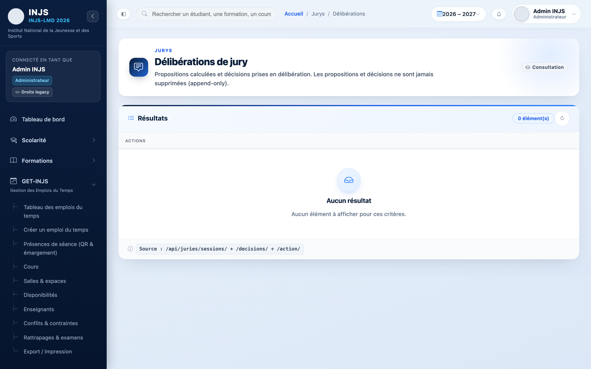

*Figure 14 — **Délibérations de jury** : la liste des candidats et leurs décisions
proposées.*

## 10.2 Qui peut y accéder

Administrateur, Direction, Chef INJS Admin, INJS Admin, Chef Secrétariat,
Secrétariat, Archiviste, Encadrant, Superviseur. La **validation** est réservée
à la Direction et à l'administration.

## 10.3 Comment y accéder

Barre latérale → **Jurys** :

| Entrée de menu | Contenu |
|----------------|---------|
| Jurys | Sessions de jury ouvertes |
| Composition | Membres de chaque jury |
| Délibérations | Décisions par candidat |
| PV de jury | Procès-verbal officiel |
| Validation | Validation et publication |

## 10.4 Actions disponibles

| Action | Comment faire | Rôle | Effet | Annulable ? |
|--------|---------------|------|-------|-------------|
| Créer une session de jury | **Jurys** → **Nouvelle session** | Secrétariat, Direction | Ouvre une session | Oui |
| Composer un jury | **Composition** → **Ajouter un membre** | Secrétariat | Complète le jury | Oui |
| Proposer une décision | **Délibérations** → sélectionner un candidat | Secrétariat | Prépare la décision | Oui |
| Acter une décision manuelle | Champ **justification** obligatoire | Direction | Fige la décision | Oui, avec motif |
| Générer le PV | **PV de jury** → **Générer** | Secrétariat | Produit le document officiel | Oui (régénération) |
| Signer le PV | **Signer** | Direction | Rend le PV opposable | Non |
| Publier les résultats | **Validation** | Direction | Rend les résultats officiels | Non |

## 10.5 La règle de la justification

Toute **décision manuelle** — c'est-à-dire toute décision qui s'écarte du
calcul automatique — exige une justification écrite. Le système refuse
l'enregistrement si le champ est vide.

C'est une règle de transparence : le procès-verbal doit pouvoir expliquer, des
années plus tard, pourquoi un candidat n'a pas été retenu malgré sa moyenne.
Rédigez une justification **factuelle**, sans appréciation personnelle.

**Exemple correct :** « Étudiant absent à 3 absences non justifiées au-delà du
seuil de 4 ; taux de présence de 58 % inférieur au seuil de 70 % fixé par la
règlementation. »

**Exemple à éviter :** « Étudiant non sérieux. »

## 10.6 Cas pratique — acter une décision manuelle

**Contexte.** Un candidat obtient `11,20` de moyenne, mais son taux de présence
est de `52 %`, inférieur au seuil de `70 %`. Le jury décide de ne pas valider.

1. **Évaluations → Résultats** : vérifiez la moyenne et le taux de présence.
2. **Jurys → Délibérations** : sélectionnez le candidat.
3. Choisissez la décision **Non validé**.
4. Saisissez la justification : « Taux de présence de 52 % inférieur au seuil
   réglementaire de 70 % ; absences non justifiées. »
5. Enregistrez : le champ est obligatoire, la saisie est refusée s'il est vide.
6. **Jurys → PV de jury** : générez le procès-verbal.
7. Faites-le **signer** par la Direction avant publication.

**Résultat attendu.** Le PV mentionne la décision et sa justification ; l'étudiant
dispose d'un document opposable.

**Contrôle de conformité.** Le total des crédits validés et la décision du PV
doivent correspondre au résultat affiché à l'écran.

## 10.7 Erreurs fréquentes et solutions

| Erreur | Cause | Solution |
|--------|-------|----------|
| « La justification est obligatoire » | Décision manuelle sans motif | Renseignez un motif factuel et vérifiez |
| Le PV ne se génère pas | Notes non validées | Terminez la validation des notes au chapitre 9 |
| Une décision est refusée | Double validation déjà effectuée | Faites annuler la précédente par la Direction |
| Le PV n'est pas signé | Étape de signature omise | Faites signer par la Direction : seul un PV signé est officiel |

## 10.8 Bonnes pratiques

- Préparez les dossiers de délibération **à l'avance** : le PV est définitif
  une fois signé.
- Faites relire les justifications : elles engagent l'institution.
- Vérifiez le total des crédits avant validation, pas après.
- Archivez le PV signé immédiatement après la session.
- Conservez les copies des sujets : elles seules permettent de justifier une
  contestation.

---

---

# 11. Finances étudiantes

## 11.1 À quoi sert ce domaine

Ce module gère la **situation financière des étudiants** : frais de scolarité,
factures, paiements, reçus, bourses et ajustements.

*Figure 15 — Tableau de bord finance : ① indicateurs de recouvrement ;
② suivi des encaissements ; ③ alertes sur les situations en attente.*

## 11.2 Qui peut y accéder

**Finance**, **Direction**, **Archiviste**. Le paramétrage financier est
réservé à la Finance et à la Direction.

## 11.3 Comment y accéder

Barre latérale → **Finances étudiantes** :

| Entrée de menu | Contenu |
|----------------|---------|
| Frais de scolarité | Grille tarifaire et échéanciers |
| Factures | Factures émises aux étudiants |
| Paiements | Encaissements et leur validation |
| Reçus | Reçus de paiement |
| Bourses & remboursements | Aides et remboursements |
| Situation financière | Situation consolidée par étudiant |
| Vacations & encadrants | Rémunération des intervenants |
| Paramétrage finance | Règles de calcul et de tarification |

## 11.4 L'écran Situation financière, zone par zone

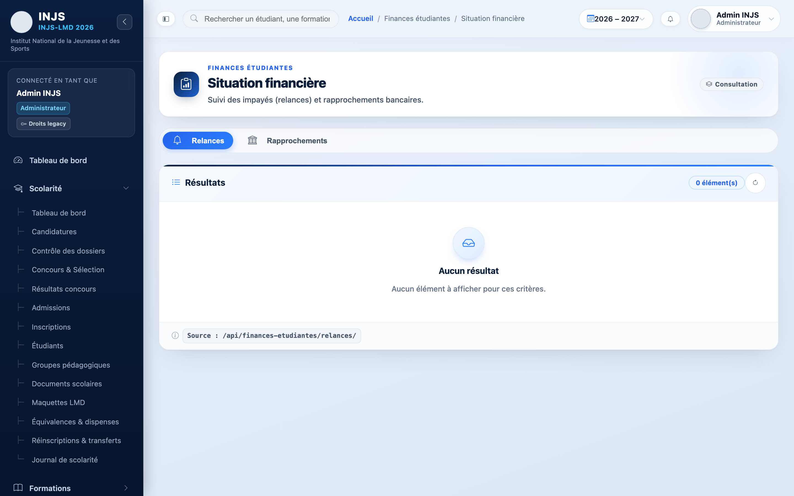

*Figure 16 — **Situation financière** : le détail des droits, des règlements et du
solde restant dû par étudiant.*

## 11.5 Actions disponibles

| Action | Comment faire | Rôle | Effet | Annulable ? |
|--------|---------------|------|-------|-------------|
| Définir un droit | **Frais de scolarité** | Finance | Crée une ligne de frais | Oui |
| Émettre une facture | **Factures** → **Nouvelle facture** | Finance | Crée une facture | Oui (annulation) |
| Saisir un paiement | **Paiements** → **Nouveau paiement** | Finance | Enregistre un encaissement | Oui |
| Valider un paiement | Action **Valider** sur le paiement | Finance | Rend l'encaissement définitif | Oui (contrôle) |
| Éditer un reçu | **Reçus** → **Éditer** | Finance | Produit le justificatif | — |
| Appliquer un ajustement | **Ajustements** | Finance, Direction | Corrige un droit manuellement | Oui (tracé) |
| Lancer une relance | **Situation financière** → **Relancer** | Finance | Crée un rappel de paiement | Oui |

## 11.6 Formulaires et champs

| Champ | Obligatoire | Format | Valeurs | Astuce |
|-------|-------------|--------|---------|---------|
| Montant | Oui | Nombre, deux décimales | — | Nombre positif ; le sens se déduit du type d'opération |
| Type de frais | Oui | Liste | Inscription, scolarité, rattrapage | Reprenez la nomenclature officielle |
| Mode de paiement | Oui | Liste | Espèces, mobile money, virement, chèque | Le reçu mentionne le mode retenu |
| Justificatif | Oui | `.pdf`, `.jpg`, `.png` | — | Joignez la preuve du versement |
| Motif d'ajustement | Oui | Texte | — | Obligatoire : tout ajustement est justifié et tracé |

## 11.7 Cas pratique — éditer un ajustement de droits

**Contexte.** Un étudiant bénéficie d'une bourse de `50 000` FCFA et ne peut
être exonéré que partiellement. Son droit de scolarité initial est de `250 000`
FCFA ; l'ajustement est de `-50 000` FCFA.

1. **Finances étudiantes** → **Ajustements**.
2. Recherchez l'étudiant concerné.
3. Cliquez sur **Nouvel ajustement**.
4. Saisissez le montant `-50 000` et le motif : « Bourse d'excellence,
   exonération partielle de la scolarité. »
5. Enregistrez.
6. Contrôlez dans **Situation financière** que le solde a diminué de `50 000`.
7. Consultez **Audit → Modifications** : l'ajustement doit y figurer avec son
   auteur et sa date.

**Résultat attendu.** Le solde passe de `250 000` à `200 000` FCFA, et
l'opération est tracée dans le journal d'audit.

**Contrôle de conformité.** L'écart entre le droit initial et le droit ajusté doit
correspondre exactement au montant de l'ajustement.

**Erreur à éviter.** Modifier directement le droit de scolarité pour effectuer un
ajustement : la modification directe n'est pas tracée, alors que l'ajustement est
spécifiquement prévu pour cela.

## 11.8 Erreurs fréquentes et solutions

| Erreur | Cause | Solution |
|--------|-------|----------|
| Le montant est refusé | Format incorrect ou signe incohérent | Saisissez un nombre à deux décimales, sans symbole monétaire |
| Le paiement reste en attente | Validation non effectuée | Validez le paiement pour le rendre définitif |
| Le solde ne correspond pas | Ajustement non justifié | Renseignez le motif : il est obligatoire |
| Le reçu est incomplet | Justificatif non joint | Joignez la preuve du versement puis rééditez |

## 11.9 Bonnes pratiques

- **Validez les paiements le jour même** : un encaissement non validé n'entre pas
  dans les recouvrements.
- N'ajustez jamais un droit par la modification directe : passez par un
  **ajustement**, qui est tracé.
- Vérifiez le solde avant d'émettre une facture : cela évite les doubles émissions.
- Exportez la situation avant toute clôture comptable.

# 12. Diplômation, archives et patrimoine

## 12.1 À quoi sert ce domaine

Ce domaine accompagne le **dernier parcours de l'étudiant** : éligibilité au
diplôme, délivrance des attestations, registres et archivage.

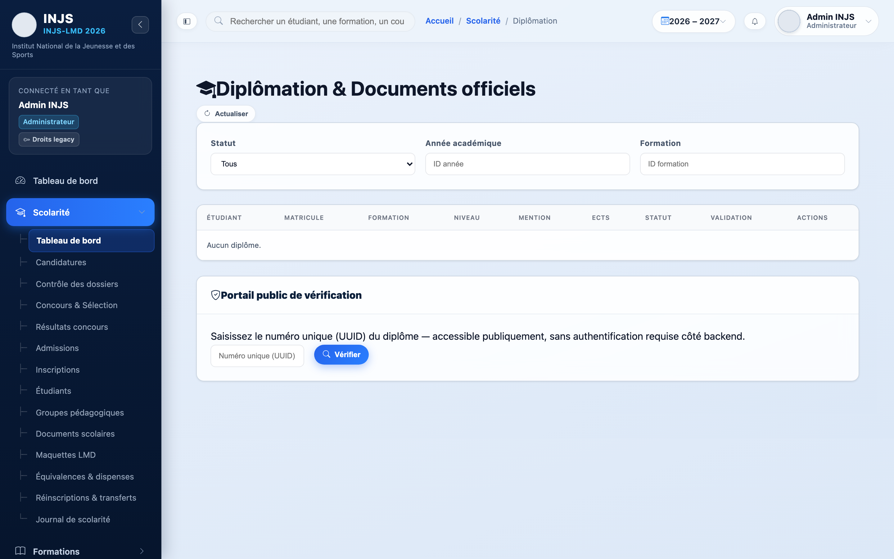

*Figure 17 — Écran **Diplômes** : les étudiants remplissant les conditions et leur
état de diplomation.*

## 12.2 Qui peut y accéder

Administrateur, Direction, Chef INJS Admin, INJS Admin, Chef Secrétariat,
Secrétariat, Archiviste, Encadrant, Superviseur.

## 12.3 Comment y accéder

| Entrée de menu | Contenu |
|----------------|---------|
| Éligibilité | Vérification des conditions d'obtention |
| Diplômes | Liste des diplômes à délivrer |
| Attestations | Attestations de réussite et de scolarité |
| Certificats | Certificats divers |
| Registres & modèles | Recueils et modèles de documents |
| Archives | Documents archivés et conservation |

## 12.4 L'écran Éligibilité, zone par zone

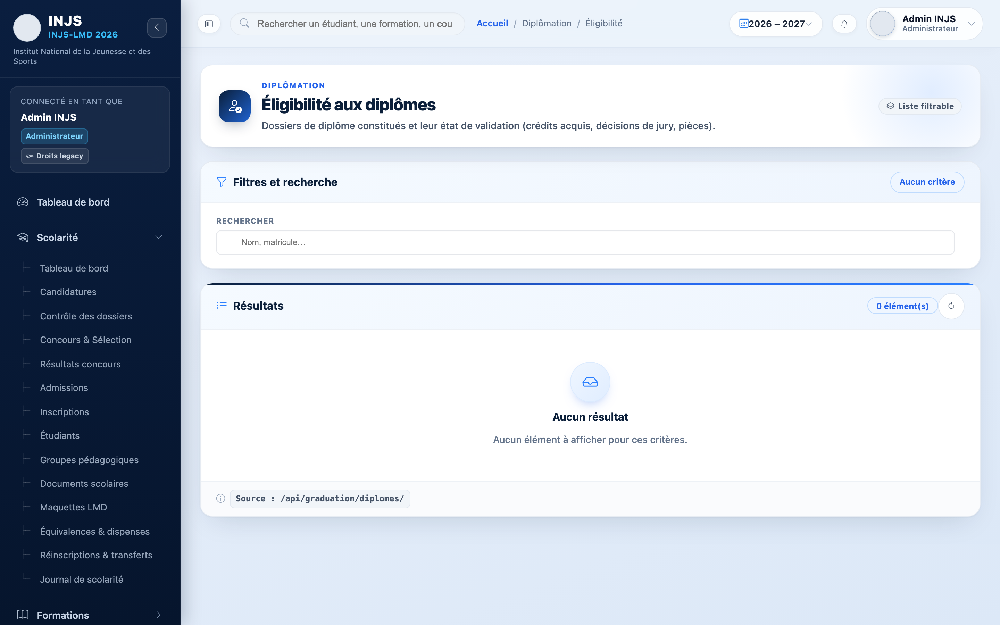

*Figure 18 — **Éligibilité** : pour chaque étudiant, le bilan des conditions de
validation et les éléments manquants éventuels.*

## 12.5 Actions disponibles

| Action | Comment faire | Rôle | Effet | Annulable ? |
|--------|---------------|------|-------|-------------|
| Vérifier l'éligibilité | **Éligibilité** | Archiviste, Secrétariat | Liste les étudiants éligibles | — |
| Valider un diplôme | **Diplômes** → **Valider** | Archiviste, Direction | Atteste l'obtention | Oui (avant délivrance) |
| Émettre une attestation | **Attestations** → **Nouvelle attestation** | Archiviste | Produit le document | Oui |
| Imprimer une attestation | Action **Imprimer** | Archiviste | Édite le document | — |
| Consigner au registre | **Registres** | Archiviste | Enregistre la délivrance | Non |
| Archiver un document | **Archives** | Archiviste, Direction | Conserve le document | Oui |

## 12.6 Cas pratique — délivrer une attestation de réussite

**Contexte.** Un étudiant a validé `60` crédits sur `60` et son taux de présence
est de `91 %`. Il est éligible au diplôme.

1. **Diplômation** → **Éligibilité**.
2. Filtrer sur l'année `2026 – 2027` et la formation concernée.
3. Vérifiez la ligne du candidat : crédits `60/60`, présence `91 %`,
   aucune UE en échec.
4. Ouvrez **Diplômes** et sélectionnez le candidat.
5. Cliquez sur **Valider le diplôme**.
6. **Attestations** → **Nouvelle attestation** de type « Attestation de
   réussite », puis **Éditer**.
7. **Registres** : consignez la délivrance.

**Résultat attendu.** L'attestation est émise, imprimable et consignée au
registre.

**Contrôle de conformité.** Le nom figurant au registre doit être exactement
celui de la pièce d'identité ; une divergence est irrattrapable après délivrance.

**Erreur à éviter.** Émettre l'attestation avant la validation des notes
(chapitre 9) : elle serait fondée sur des résultats incomplets.

## 12.7 Erreurs fréquentes et solutions

| Erreur | Cause | Solution |
|--------|-------|----------|
| L'étudiant n'est pas éligible | Crédits insuffisants ou UE non validées | Vérifiez le détail affiché par l'écran d'éligibilité |
| L'attestation ne se génère pas | Notes non validées | Terminez la validation des notes |
| Le registre ne concorde pas | Retrait non consigné | Consignez chaque délivrance immédiatement |

## 12.8 Bonnes pratiques

- **Vérifiez l'orthographe du nom** avant toute délivrance : une attestation
  porte un nom officiel.
- Consignez au registre **le jour même** : un registre à jour est la preuve
  juridique de la délivrance.
- Archivez les PV signés (chapitre 10) avec les attestations : ils forment le
  dossier de diplôme complet.

---

# 13. Stages

## 13.1 À quoi sert ce domaine

Ce module encadre les **stages** : conventions, organismes d'accueil, affectation
des tuteurs, suivi et évaluation.

*Figure 19 — **Conventions** : les stages ouverts, leur organisme d'accueil, leurs
dates et leur état de signature.*

## 13.2 Qui peut y accéder

Administrateur, Direction, Chef INJS Admin, INJS Admin, Chef Secrétariat,
Secrétariat, Archiviste, Encadrant, Superviseur.

## 13.3 Comment y accéder

Barre latérale → **Stages** :

| Entrée de menu | Contenu |
|----------------|---------|
| Conventions | Accords de stage et leur état |
| Organismes | Organismes d'accueil référencés |
| Affectations & tuteurs | Affectation des encadrants |
| Suivi des stages | Présence et progression |
| Évaluations | Évaluation de fin de stage |

## 13.4 Actions disponibles

| Action | Comment faire | Rôle | Effet | Annulable ? |
|--------|---------------|------|-------|-------------|
| Créer une convention | **Conventions** → **Nouvelle convention** | Secrétariat, encadrement | Ouvre le dossier de stage | Oui |
| Signer une convention | Action **Signer** | Secrétariat, encadrement | Enregistre une signature | Non |
| Ajouter un organisme | **Organismes** | Secrétariat | Référence un employeur | Oui |
| Affecter un tuteur | **Affectations & tuteurs** | Encadrement | Désigne l'encadrant | Oui |
| Pointer la présence | **Suivi des stages** | Encadrant | Enregistre la présence en stage | Oui |
| Évaluer le stage | **Évaluations** | Encadrement | Remplit la fiche d'évaluation | Oui |

## 13.5 Cas pratique — suivre la présence en stage

**Contexte.** Un stagiaire doit justifier `8` semaines de présence sur `10`.

1. **Stages** → **Suivi des stages**.
2. Ouvrez la convention du stagiaire.
3. Pointer chaque semaine de présence, ou importez le relevé fourni par
   l'organisme d'accueil.
4. À la fin, vérifiez le total : `8` semaines pointées sur `10` prévues.
5. **Évaluations** : saisissez la note de l'encadrant.

**Résultat attendu.** La présence est consolidée et l'évaluation complète le
dossier, condition de la validation.

**Contrôle de conformité.** Le nombre de semaines pointées doit correspondre au
relevé de l'organisme d'accueil.

## 13.6 Erreurs fréquentes et solutions

## 13.7 Bonnes pratiques

- Lancez la procédure de convention **avant** le début du stage : une convention
  non signée engage l'institution.
- Pointer la présence **chaque semaine** : un rattrapage massif est peu fiable.
- Archivez le rapport de fin de stage avec la convention.

# 14. Personnel, administration et organisation

## 14.1 À quoi sert ce domaine

Ce domaine décrit l'**organisation** de l'institution et son personnel : agents,
affectations, documents, services, départements, directions et organigramme.

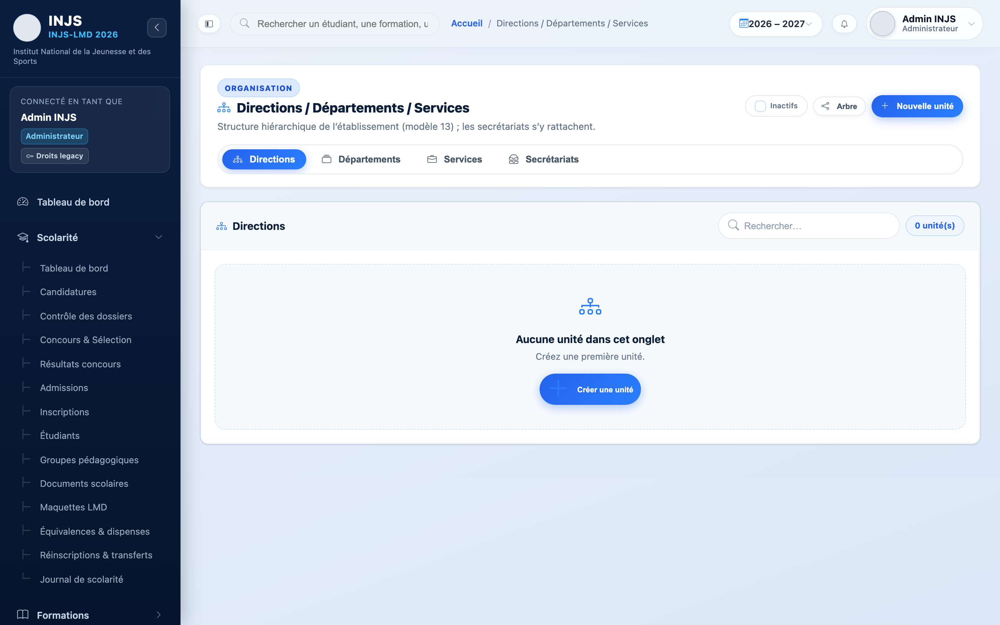

*Figure 20 — **Organigramme** : la hiérarchie des services et des départements de
l'institution.*

## 14.2 Qui peut y accéder

Administrateur, Direction, Chef INJS Admin, INJS Admin, Chef Secrétariat,
Secrétariat, Archiviste, Encadrant, Superviseur. Les écrans de gestion du
personnel sont plus restreints que les écrans de consultation.

## 14.3 Comment y accéder

| Module | Entrées de menu |
|--------|-----------------|
| **Personnel** | Agents, Affectations, Disponibilités, Documents |
| **Administration** | Services, Départements, Directions, Organisation, Secrétariats, Courrier, Réunions, Archives |

## 14.4 L'écran Agents, zone par zone

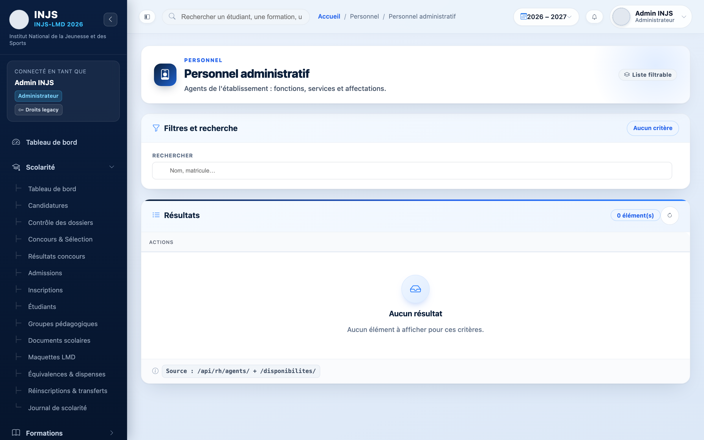

*Figure 21 — Écran **Agents** : la liste des personnels, leur fonction et leur
affectation.*

## 14.5 Actions disponibles

| Action | Comment faire | Rôle | Effet | Annulable ? |
|--------|---------------|------|-------|-------------|
| Créer un service | **Services** → **Nouveau service** | Administrateur, Direction | Ajoute une unité | Oui |
| Créer un département | **Départements** | Administrateur, Direction | Ajoute un département | Oui |
| Affecter un agent | **Affectations** | Administrateur | Change l'affectation | Oui |
| Déclarer une disponibilité | **Disponibilités** | Encadrant | Autorise un créneau | Oui |
| Enregistrer un document | **Documents** | Secrétariat | Attache une pièce au dossier | Oui |
| Consigner un courrier | **Courrier** | Secrétariat | Enregistre une entrée ou un départ | Oui |
| Consigner une réunion | **Réunions** | Secrétariat | Enregistre une réunion | Oui |

## 14.6 Cas pratique — créer un service et y rattacher un agent

**Contexte.** L'institution crée un service « Pédagogique » rattaché au
département « Sciences du Sport ».

1. **Administration** → **Services** → **Nouveau service**.
2. Saisissez l'intitulé exact : `Pédagogique`.
3. Rattachez-le au département **Sciences du Sport**.
4. Enregistrez.
5. **Personnel → Agents** : ouvrez la fiche de l'agent concerné.
6. Changez son service d'affectation, enregistrez.
7. Vérifiez dans l'**Organigramme** que le service apparaît au bon niveau.

**Résultat attendu.** Le service est créé, l'agent y est rattaché et
l'organigramme est à jour.

## 14.7 Erreurs fréquentes et solutions

| Erreur | Cause | Solution |
|--------|-------|----------|
| Le service apparaît en double | Doublon créé | Réutilisez le service existant |
| L'agent n'est pas rattaché | Affectation non enregistrée | Rouvrez sa fiche et enregistrez l'affectation |
| L'organigramme est incomplet | Service sans agent rattaché | Vérifiez les affectations avant de publier l'organigramme |

## 14.8 Bonnes pratiques

- Nommez les unités **exactement** comme dans les textes officiels : le nom d'un
  service apparaît sur les documents délivrés aux étudiants.
- Vérifiez l'organigramme **une fois par an**, lors de la révision des
  habilitations.
- N'attribuez à une personne que **les services réellement concernés**.

---

| Erreur | Cause | Solution |
|--------|-------|----------|
| La convention ne se signe pas | Une des trois parties n'a pas signé | Vérifiez les trois signatures avant signature dans l'application |
| Le stage n'apparaît pas | Filtre d'année ou statut | Changez d'année et effacez les filtres |
| Le tuteur est déjà affecté | Affectation existante | Modifiez l'affectation existante |

# 15. Utilisateurs, comptes et habilitations

## 15.1 À quoi sert ce domaine

Ce domaine gère les **comptes** de l'application : création, rôles, permissions,
délégations, dérogations, provisioning et journal des accès.

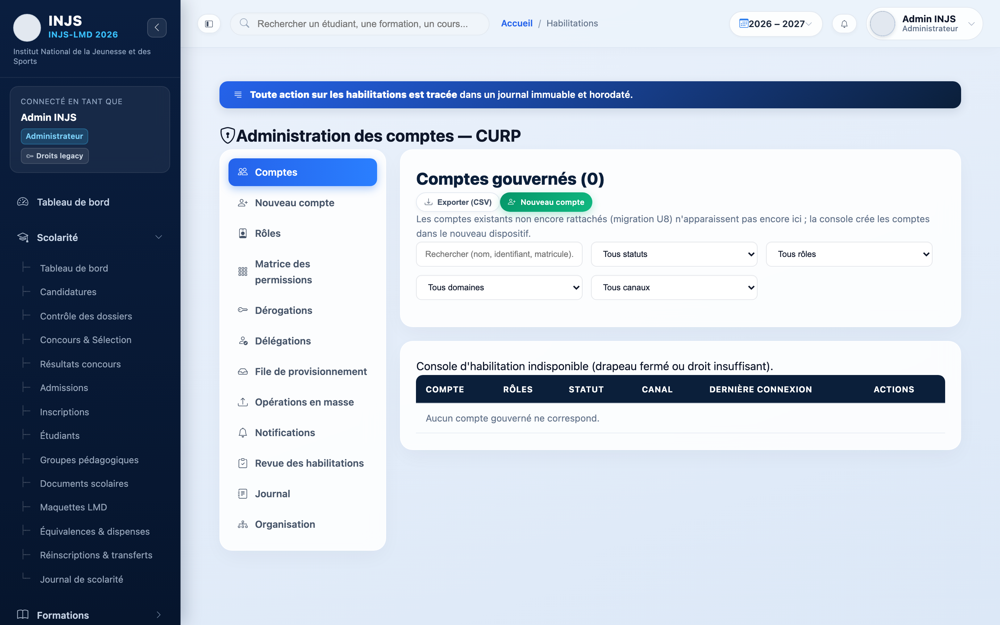

*Figure 22 — **Comptes utilisateurs** : la liste des comptes, leur rôle et leur
état.*

## 15.2 Qui peut y accéder

Administrateur, Direction, Chef INJS Admin, INJS Admin, Chef Secrétariat,
Secrétariat. La console d'administration complète exige en plus une habilitation
spécifique.

## 15.3 Comment y accéder

Barre latérale → **Utilisateurs & Accès** :

| Entrée de menu | Contenu |
|----------------|---------|
| Comptes utilisateurs | Liste des comptes et de leurs rôles |
| Rôles | Définition des 12 rôles |
| Permissions | Matrice des droits par rôle |
| Départements & Services | Rattachement organisationnel des comptes |
| Profils | Fiches individuelles |
| Dérogations | Exceptions de droits tracées |
| Délégations | Transferts temporaires de droits |
| Revue des habilitations | Réexamen périodique des droits |
| File de provisionnement | Comptes en attente de création |
| Opérations en masse | Actions groupées sur plusieurs comptes |
| Notifications | Alertes de la console |
| Journal des accès | Traçabilité des accès |
| Politique de sécurité | Règles de mot de passe et de session |

## 15.4 La matrice des permissions

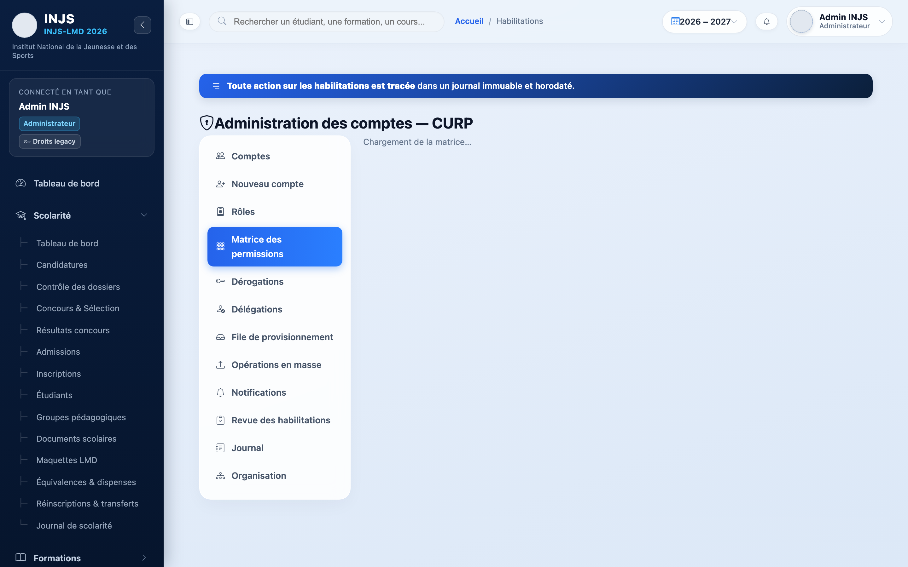

*Figure 23 — **Matrice des permissions** : le tableau croisé des rôles et des
actions autorisées.*

## 15.5 Actions disponibles

| Action | Comment faire | Rôle | Effet | Annulable ? |
|--------|---------------|------|-------|-------------|
| Créer un compte | **Comptes utilisateurs** → **Nouveau compte** | Administrateur, Secrétariat | Crée un accès | Oui (désactivation) |
| Changer un rôle | Fiche du compte, champ **Rôle** | Administrateur, Direction | Modifie les droits | Oui |
| Accorder une dérogation | **Dérogations** | Administrateur | Accorde un droit exceptionnel | Oui, tracée |
| Créer une délégation | **Délégations** | Administrateur, Direction | Transfère des droits temporairement | Oui |
| Opérer en masse | **Opérations en masse** | Administrateur | Agit sur plusieurs comptes | Oui |
| Révoquer un accès | Fiche du compte, **Désactiver** | Administrateur | Supprime l'accès | Oui (réactivation) |

## 15.6 La règle du compte nominatif

Chaque personne doit disposer de son **propre compte**, nominatif et rattaché à
son rôle. Un compte partagé est interdit : la piste d'audit devient inutilisable
puisqu'on ne peut plus attribuer une action à son auteur.

## 15.7 Cas pratique — créer un compte et vérifier ses droits

**Contexte.** Vous devez créer le compte d'un nouveau encadrant, rôle

## 15.8 Erreurs fréquentes et solutions

| Erreur | Cause | Solution |
|--------|-------|----------|
| « Vous ne pouvez pas supprimer ce compte » | Compte concerné par des actions tracées | Désactivez le compte plutôt que de le supprimer |
| La création est bloquée | File de provisionnement | Traitez la file ou passez par une opération en masse |
| Les droits ne correspondent pas | Rôle non aligné ou délégation expirée | Vérifiez le rôle, puis les délégations en cours |
| Une dérogation est refusée | Habilitation administration absente | Demandez l'habilitation à la Direction |

## 15.9 Bonnes pratiques

- Créez les comptes **à l'arrivée** des personnes, pas au fil de l'eau.
- **Désactivez** les comptes au départ : ne supprimez pas, la traçabilité doit
  être conservée.
- Faites une **revue des habilitations** au moins une fois par an.
- Accordez le rôle le plus **restrictif** qui permette l'activité.

---

**Contrôle de conformité.** Le rattachement du service au bon département conditionne
les listes de diffusion et les habilitations.

**Erreur à éviter.** Créer un service en double à la suite d'une faute de frappe :
la duplication trouble les statistiques et les habilitations.

# 16. Statistiques et bilans

## 16.1 À quoi sert ce domaine

Ce domaine consolide l'activité de l'institution en **indicateurs** et en
**bilans** : effectifs, admissions, inscriptions, résultats, finances et assiduité.

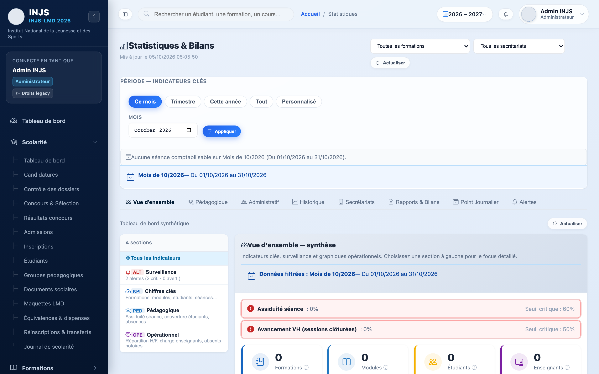

*Figure 24 — **Statistiques** : les indicateurs consolidés de l'année en cours.*

## 16.2 Qui peut y accéder

Administrateur, Direction, Chef INJS Admin, INJS Admin, Chef Secrétariat,
Secrétariat, Finance, Archiviste, Encadrant. Les statistiques **globales** sont
réservées à la Direction, à la Finance, aux Archivistes et à l'administration.

## 16.3 Comment y accéder

Barre latérale → **Statistiques** :

| Entrée de menu | Contenu |
|----------------|---------|
| Tableau de bord | Synthèse générale |
| Candidatures | Statistiques des candidatures |
| Admissions | Statistiques des admissions |
| Inscriptions | Statistiques des inscriptions |
| Effectifs | Répartition des effectifs |
| Résultats | Statistiques de réussite |
| Finances | Statistiques financières |
| Rapports | Rapports et bilans à construire et publier |
| Alertes & seuils | Seuils et alertes institutionnelles |

## 16.4 L'écran Rapports et bilans, zone par zone

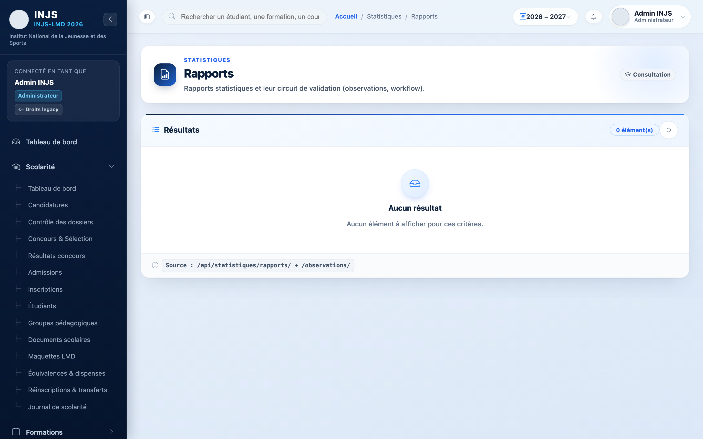

*Figure 25 — **Rapports** : la chaîne de production d'un bilan, de l'observation à
la publication.*

Les écrans de statistiques affichent en permanence la **source des données**,
indiquée sous le tableau : cela permet de remonter à l'ensemble consultationné.

## 16.5 Actions disponibles

| Action | Comment faire | Rôle | Effet | Annulable ? |
|--------|---------------|------|-------|-------------|
| Consulter un indicateur | Sélectionner un écran de statistiques | selon le rôle | Affiche les chiffres | — |
| Modifier un seuil | **Alertes & seuils** | Administrateur, Direction | Déclenche les alertes | Oui |
| Générer un rapport | **Rapports** → **Générer** | Administrateur, encadrement | Produit un bilan | Oui |
| Publier un rapport | **Rapports** → **Publier** | Direction | Rend le rapport visible | Non |
| Exporter un bilan | Bouton d'export | selon le rôle | Produit un `.xlsx` ou `.pdf` | — |

## 16.6 Cas pratique — produire un bilan d'effectifs

**Contexte.** La Direction demande le bilan des effectifs de la Licence 1 pour
l'année `2026 – 2027`, répartis par groupe et par sexe.

1. **Statistiques** → **Effectifs**.
2. Vérifiez le sélecteur d'année : il doit indiquer `2026 – 2027`.
3. Filtrer sur la formation **Licence 1**.
4. Affichez la répartition par groupe et par sexe.
5. Contrôlez le total : par exemple `120` étudiants, dont `68` en `L1-G1` et
   `52` en `L1-G2`, soit `120` au total.
6. Vérifiez la cohérence : `68 + 52 = 120`.
7. Exportez en `.xlsx` puis transmettez au format demandé.

**Résultat attendu.** Le bilan est exporté et le total est cohérent avec la somme
des groupes.

**Contrôle de conformité.** Le total doit être identique à celui affiché dans
**Scolarité → Étudiants** pour la même année.

**Erreur à éviter.** Construire un bilan sur l'année précédente par oubli du
sélecteur : le rapport est alors faux sans être faux d'apparence.

## 16.7 Erreurs fréquentes et solutions

| Erreur | Cause | Solution |
|--------|-------|----------|
| Les chiffres sont à zéro | Année sans données saisies | Changez d'année, ou saisissez les données en amont |
| Le total ne correspond pas | Filtre résiduel | Effacez tous les filtres et refaites le calcul |
| Un rapport ne se publie pas | Observations non approuvées | Terminez le circuit de validation |
| L'export est vide | Périmètre sans donnée | Élargissez le périmètre ou changez d'année |

## 16.8 Bonnes pratiques

- Vérifiez **toujours** l'année avant de construire un indicateur.
- Recoupez un chiffre avec **deux écrans différents** avant de le publier.
- Exportez systématiquement avec la mention de l'année et du périmètre.
- Un rapport publié est **opposable** : relisez-le avant validation.

---
`ENCADRANT`, qui pourra consulter les emplois du temps et saisir les présences.

1. **Utilisateurs & Accès** → **Comptes utilisateurs** → **Nouveau compte**.
2. Saisissez l'identifiant, le nom et l'adresse de messagerie professionnelle.
3. Sélectionnez le rôle `ENCADRANT`.
4. Rattachez le compte à son service, par exemple **Pédagogique**.
5. Enregistrez. Un mot de passe initial est attribué : **remplacez-le dès la
   première connexion**, l'application l'exigera.
6. Connectez-vous avec ce compte dans un autre navigateur.
7. Contrôlez que la barre latérale affiche bien **GET-INJS** et ses entrées.
8. Vérifiez dans **Journal des accès** que la connexion est tracée.

**Résultat attendu.** Le compte est actif, l'encadrant voit ses modules et chaque
action est attribuée à son auteur.

**Contrôle de conformité.** L'utilisateur ne doit voir **que** les écrans de son
rôle : ni plus (excès de droits), ni moins (blocage métier).

**Erreur à éviter.** Attribuer le rôle `ADMIN` « pour aller plus vite » : ce rôle
donne un accès complet et annule toute séparation des responsabilités.

# 17. Référentiels, paramètres et imports

## 17.1 À quoi sert ce domaine

Ce domaine porte les **données de référence** sur lesquelles s'appuient tous les
autres modules, ainsi que les règles de calcul du LMD et le chargement massif de
données.

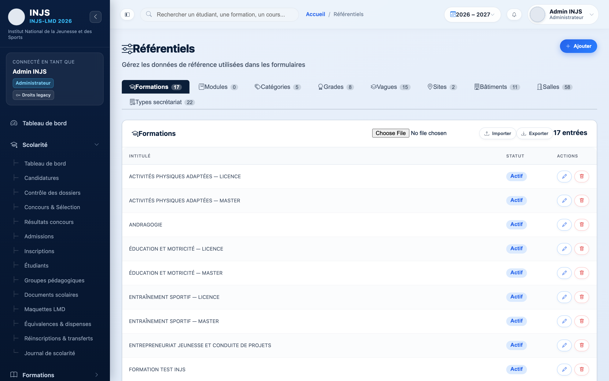

*Figure 26 — **Tous les référentiels** : le point d'entrée unique vers les données
de référence.*

## 17.2 Qui peut y accéder

Administrateur, Direction, Chef INJS Admin, INJS Admin, Chef Secrétariat,
Secrétariat. Les **paramètres** et les **drapeaux** sont plus restreints.

## 17.3 Comment y accéder

Barre latérale → **Référentiels** :

| Entrée de menu | Contenu |
|----------------|---------|
| Tous les référentiels | Point d'entrée vers tous les référentiels |
| Années académiques | Ouverture et clôture des années |
| Établissements & sites | Sites de l'institution |
| Formations, Filières, Niveaux, Semestres | Référentiels pédagogiques |
| UE / ECUE, Types de cours | Référentiels d'enseignement |
| Paramètres LMD | Règles de calcul des moyennes et des crédits |
| Fonctionnalités (drapeaux) | Activation des fonctions |
| Imports de données (Excel) | Chargement massif |

## 17.4 L'écran Paramètres LMD, zone par zone

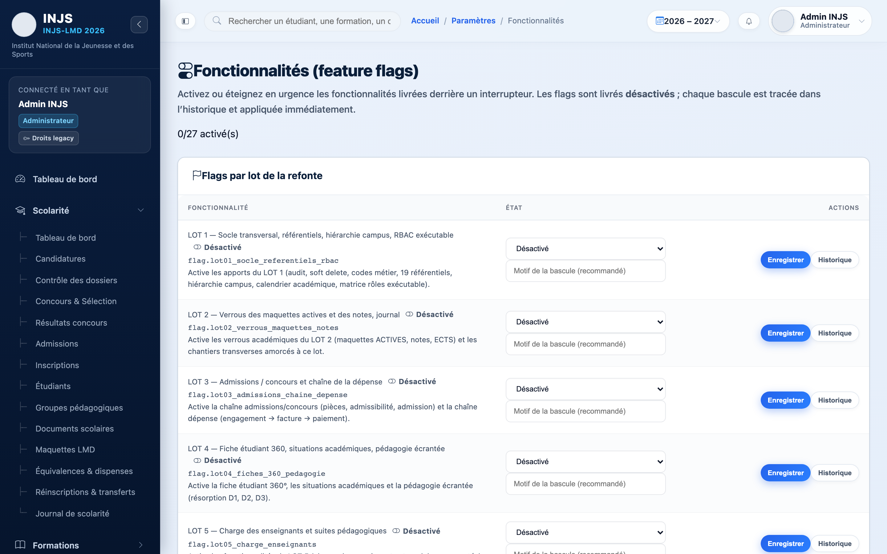

*Figure 27 — **Paramètres LMD et fonctionnalités** : les règles de calcul et les
fonctions activées.*

## 17.5 Les imports Excel

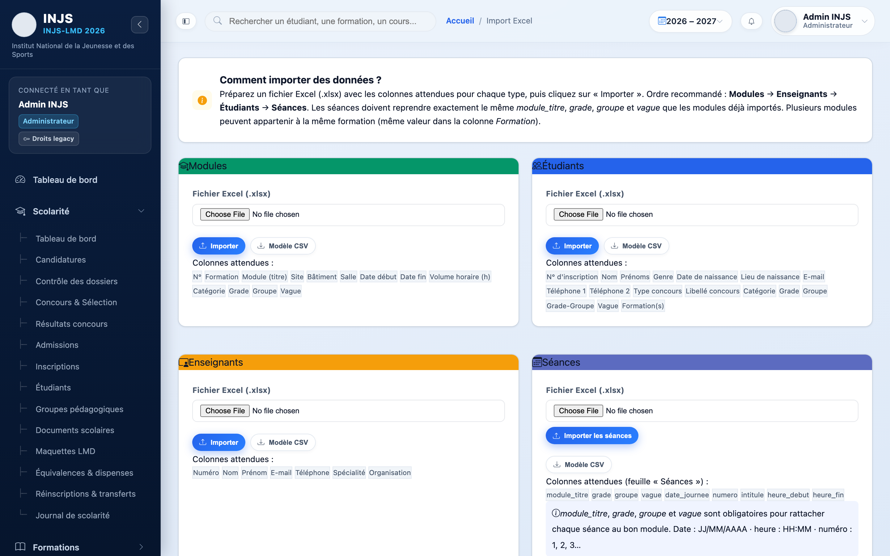

*Figure 28 — **Imports de données** : le dépôt d'un fichier `.xlsx` et son
traitement ligne par ligne.*

L'import permet de charger des effectifs, des notes ou des référentiels depuis un
fichier `.xlsx`. **Il n'efface rien** : il ajoute ou complète des enregistrements
existants.

## 17.6 Cas pratique — importer des effectifs depuis Excel

**Contexte.** Vous devez créer `120` étudiants d'une nouvelle promotion depuis un
fichier `effectifs-l1-2026.xlsx`.

1. **Référentiels** → **Imports de données (Excel)**.
2. Déposez le fichier `.xlsx`.
3. Vérifiez la **correspondance des colonnes** : l'application annonce
   l'équivalence de chaque colonne avec un champ attendu.
4. Lancez l'analyse : le fichier est contrôlé **ligne par ligne**.
5. Lisez le rapport : chaque ligne rejetée est signalée avec son motif
   (matricule en double, date invalide, colonne manquante).
6. Corrigez les lignes rejetées dans le fichier, puis **rechargez**.
7. Une fois le rapport vide d'erreur, **validez l'import**.

**Résultat attendu.** `120` étudiants créés ; les lignes rejetées, si elles
existaient, sont documentées.

**Contrôle de conformité.** Comptez les lignes importées et rapprochez-les de
l'effectif annoncé sur la liste de cours.

**Erreurs à éviter.**

- **Valider un import sans lire le rapport** : des lignes peuvent être ignorées.
- **Relancer un import déjà validé** : cela crée des doublons.
- **Déposer un `.xls` ou un `.csv`** : seul le `.xlsx` est accepté.

## 17.7 Erreurs fréquentes et solutions

| Erreur | Cause | Solution |
|--------|-------|----------|
| Le fichier est refusé | Format autre que `.xlsx` | Convertissez le fichier au format `.xlsx` |
| Toutes les lignes sont rejetées | Colonnes mal nommées ou feuille vide | Vérifiez la correspondance des colonnes annoncée |
| Une ligne est rejetée | Matricule en double ou valeur invalide | Corrigez la ligne et rechargez le fichier |
| L'import ne change rien | Fichier non validé | Terminez la lecture du rapport puis validez |
| Un paramètre est en lecture seule | Droit insuffisant | Adressez-vous à l'administration |

## 17.8 Bonnes pratiques

- **Nommez vos colonnes** comme l'application les attend, et vérifiez la
  correspondance affichée avant de valider.
- Importez par **lots de 200 à 500 lignes** : un lot important est difficile à
  contrôler.
- Conservez le fichier source : il est la preuve de ce qui a été chargé.
- Ne modifiez un paramètre LMD **qu'avec un texte officiel** à l'appui.

# 18. Audit, sécurité et confidentialité

## 18.1 À quoi sert ce domaine

Ce domaine garantit la **traçabilité** : qui a fait quoi, quand, sur quelles
données, et selon quelles règles de sécurité.

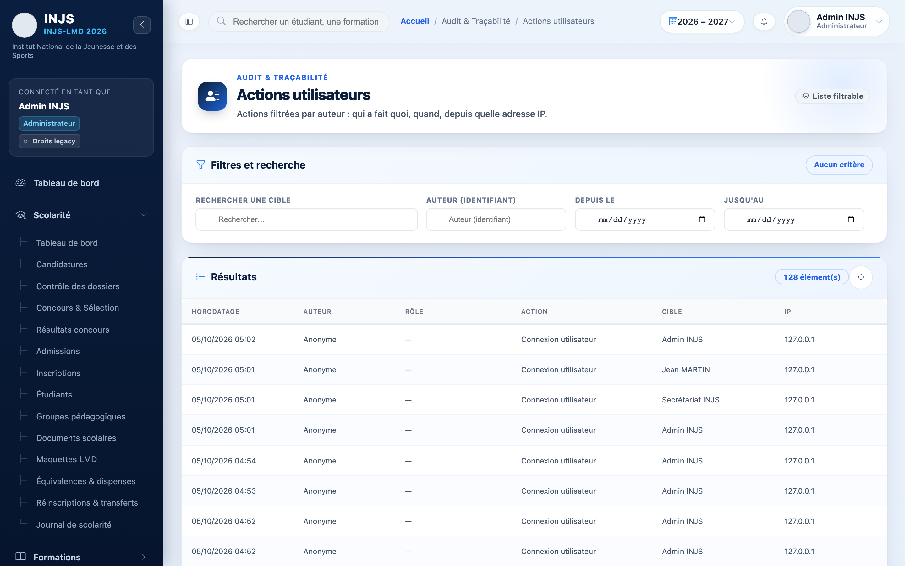

*Figure 29 — **Journal des actions** : l'historique horodaté des opérations
réalisées dans l'application.*

## 18.2 Qui peut y accéder

Administrateur, Direction, Chef INJS Admin, INJS Admin, Archiviste.

## 18.3 Comment y accéder

Barre latérale → **Audit & Traçabilité** :

| Entrée de menu | Contenu |
|----------------|---------|
| Actions utilisateurs | Qui a fait quoi |
| Modifications | Détail des changements apportés aux données |
| Événements de sécurité | Connexions, échecs, incidents |
| Intégrité de la chaîne | Vérification de la chaîne de conservation |
| Archives | Conservation des pièces justificatives |

## 18.4 Ce qui est tracé

| Type d'action | Exemple | Où la retrouver |
|---------------|---------|-----------------|
| Création | Création d'un compte, d'un module, d'une formation | Modifications |
| Modification | Changement de statut, mise à jour d'un droit | Modifications |
| Suppression | Retrait d'un dossier | Modifications |
| Sécurité | Connexion, échec, changement de mot de passe | Événements de sécurité |
| Décision | Décision pédagogique ou de jury | Actions utilisateurs |
| Génération de document | Attestation, PV, reçu | Actions utilisateurs |

## 18.5 Les règles de sécurité à appliquer

1. **Un compte nominatif par personne.** Jamais de compte partagé.
2. **Changer son mot de passe** à la première connexion et régulièrement.
3. **Verrouiller sa session** en quittant le poste.
4. **Ne jamais communiquer** ses identifiants, même à un collègue.
5. **Utiliser le lien officiel** : ne pas saisir d'adresse fournie par un tiers.
6. **Signaler immédiatement** toute connexion inhabituelle.

## 18.6 Ce qu'il ne faut jamais faire

| Interdit | Pourquoi |
|----------|----------|
| Partager un compte | La piste d'audit devient inutilisable |
| Photographier un écran contenant des données d'étudiants | Diffusion non contrôlée de données personnelles |
| Laisser un export ouvert sur un poste partagé | Fuite de données |
| Transmettre un export par messagerie non sécurisée | Données nominatives en clair |
| Réutiliser le mot de passe d'un autre compte | Compromission croisée |
| Modifier un paramètre sans texte officiel | Décision non traçable |

## 18.7 Cas pratique — tracer l'origine d'un ajustement financier

**Contexte.** Un étudiant conteste un ajustement de `-50 000` FCFA.

1. **Audit & Traçabilité** → **Modifications**.
2. Recherchez l'étudiant ou filtrez sur la période.
3. La ligne de l'ajustement indique : l'auteur du changement, sa date et son
   heure, la valeur avant et après, et le motif.
4. Ouvrez **Actions utilisateurs** : la chaîne complète est reconstituable.
5. Communiquez à l'étudiant la date, le motif et l'auteur de l'ajustement.

**Résultat attendu.** L'origine de l'ajustement est démontrable et opposable.

**Contrôle de conformité.** Le motif enregistré doit correspondre à la

## 18.8 Erreurs fréquentes et solutions

| Erreur | Cause | Solution |
|--------|-------|----------|
| Une action n'apparaît pas dans le journal | Périmètre de dates ou droits insuffisants | Élargissez la période et vérifiez vos droits |
| Un compte est verrouillé | Plusieurs échecs d'authentification | Patientez quelques minutes, puis réessayez |
| Une action est refusée | Habilitation insuffisante | Demandez une dérogation auprès de l'administration |

## 18.9 Bonnes pratiques

- Consultez le journal **régulièrement**, pas seulement en cas d'incident.
- Signalez tout comportement anormal à l'administration.
- Conservez les traces : une décision non traçable n'est pas opposable.
- Verrouillez votre poste à chaque fois que vous le quittez.

# 19. Cas pratiques transversaux

Ces scénarios traversent plusieurs modules. Ils reproduisent le travail réel d'une
journée, de la première connexion au résultat final.

## 19.1 Administrateur — créer un utilisateur et vérifier ses droits

**Contexte.** Un nouvel encadrant arrive et doit être opérationnel avant la rentrée.

1. **Utilisateurs & Accès → Comptes utilisateurs → Nouveau compte**.
2. Identifiant `encadrant.nouveau`, nom, messagerie professionnelle.
3. Rôle `ENCADRANT`, service **Pédagogique**.
4. Enregistrez : un mot de passe initial est attribué.
5. Connectez-vous avec ce compte et vérifiez la barre latérale : **GET-INJS**
   doit apparaître, pas **Finances étudiantes**.
6. Faites changer le mot de passe à la première connexion.

**Résultat attendu.** Le compte est actif avec le bon périmètre, et le
changement de mot de passe est imposé.

**Contrôle de conformité.** Ni excès de droits, ni blocage métier.

## 19.2 Secrétariat — inscrire un participant et l'affecter

**Contexte.** `DIALLO Amadou`, admis en Master 2, doit être inscrit.

1. **Scolarité → Candidatures** : localisez son dossier `CAND-2026-2027-0001`.
2. Vérifiez la complétude : `7/7` pièces validées.
3. **Scolarité → Admissions** : validez l'admission.
4. **Scolarité → Inscriptions → Nouvelle inscription**.
5. Choisissez la formation et l'année `2026 – 2027`.
6. Affectez-le au groupe `M2-A` et enregistrez.
7. Vérifiez que l'étudiant apparaît dans **Étudiants** et dans son groupe.

**Résultat attendu.** L'étudiant est inscrit, rattaché à son groupe et visible
dans les emplois du temps.

**Contrôle de conformité.** Le matricule est unique et l'année est correcte.

## 19.3 Encadrant — consulter l'EDT et saisir les présences

**Contexte.** Séance du lundi à `08:00`, groupe `L1-G1`, salle 2.

1. **GET-INJS → Tableau des emplois du temps** : repérez votre séance.
2. Le jour même, ouvrez **Présences de séance**.
3. Affichez le **QR** pendant l'appel, puis émargez les retardataires.
4. **Clôturez** la séance.

**Résultat attendu.** La séance est clôturée et le taux de présence du groupe est
mis à jour.

**Contrôle de conformité.** Le nombre de pointés est égal ou inférieur à
l'effectif du groupe.

## 19.4 Étudiant — badger une séance

1. Ouvrir l'application mobile et choisir **Badger**.
2. Scanner le **QR** affiché par l'enseignant.
3. L'enregistrement est horodaté ; un scan hors périmètre est refusé.
4. Consulter son **historique de présence** pour vérifier.

**Résultat attendu.** La présence est enregistrée et visible dans l'historique.

**Erreur à éviter.** Scanner hors de l'enceinte en pensant à un bug : c'est la
géofence qui joue son rôle.

## 19.5 Responsable — produire un bilan de présence par module

**Contexte.** Bilan demandé sur les `6` derniers mois.

1. **Statistiques** : ouvrez l'écran correspondant aux présences.
2. Vérifiez l'année, puis filtrez par module.
3. Vérifiez que les séances sont **clôturées** : seules les clôturées sont
   consolidées.

## 19.6 Jury — constituer le jury et acter une décision

**Contexte.** Session de rattrapage, `42` candidats.

1. **Jurys → Jurys → Nouvelle session** : formation et période.
2. **Composition** : ajoutez les membres.
3. **Délibérations** : sélectionnez chaque candidat, reportez la décision.
4. Pour toute décision manuelle, saisissez la **justification** : elle est
   obligatoire.
5. **PV de jury → Générer**, puis faites **signer** par la Direction.
6. **Validation** : publiez les résultats.

**Résultat attendu.** Un PV signé et publié, chaque décision manuelle motivée.

**Contrôle de conformité.** Le total des crédits du PV correspond au résultat.

## 19.7 Finance — éditer un ajustement

**Contexte.** Bourse d'excellence de `50 000` FCFA sur une scolarité de `250 000`
FCFA.

1. **Finances étudiantes → Ajustements**.
2. Montant `-50 000`, motif détaillé et factuel.
3. Enregistrez et vérifiez le solde dans **Situation financière**.
4. Contrôlez la trace dans **Audit → Modifications**.

**Résultat attendu.** Solde ramené à `200 000` FCFA, opération tracée.

**Contrôle de conformité.** L'écart correspond exactement au montant saisi
et la justification affichée au chapitre 11 est renseignée.

# 20. Gains d'efficience

## 20.1 Raccourcis de navigation

| Astuce | Gain |
|--------|------|
| Utilisez le **fil d'Ariane** pour revenir en arrière | Évite de remonter tout le menu |
| Le sélecteur d'année (④) est global | Ne changez pas d'onglet pour changer d'année |
| La barre de recherche (②) est transversale | Passez par elle quand vous connaissez un nom |
| Les en-têtes de tableau sont cliquables | Triez sans revenir aux filtres |

## 20.2 Le traitement par lots

Sur les écrans qui le proposent, cochez plusieurs lignes puis appliquez une action
unique. Sur un écran de `5 000` lignes, cela remplace `5 000` manipulations par
`10`.

**Attention :** relisez toujours le nombre d'éléments annoncé par la confirmation
avant de valider une action groupée.

## 20.3 Les exports bien ciblés

| Pratique | Gain |
|----------|------|
| Exporter une formation et un mois plutôt qu'une année | Fichier exploitable, non un classur de plusieurs milliers de lignes |
| Exporter après avoir appliqué les filtres | Le fichier correspond exactement à l'écran |
| Archiver les exports par année | Retrouver un bilan en quelques secondes |

## 20.4 Reprendre un travail interrompu

1. Notez les filtres appliqués avant toute interruption.
2. Exportez si vous entrez dans une saisie longue.
3. Notez le dernier enregistrement effectué.
4. Reprenez sur la même année et le même périmètre.

## 20.5 Gains chiffrés observés

| Opération | Méthode classique | Méthode efficace | Gain |
|-----------|------------------|------------------|------|
| Pointage d'une séance de `120` étudiants | Émargement manuel : `10` min | Badgeage QR : moins de `1` min | environ `9` minutes |
| Création de `120` étudiants | Saisie individuelle : plusieurs heures | Import Excel validé : quelques minutes | près de `90 %` |
| Bilan d'effectifs | Plusieurs extractions | Un rapport filtré et exporté | de `20` min à `2` min |

---

# 21. Aide au dépannage

## 21.1 Annuaire des incidents courants

| Symptôme ou message | Cause probable | Solution pas à pas | Qui contacter |
|--------------------|----------------|--------------------|--------------|
| « Identifiants invalides » | Identifiant ou mot de passe erroné | ① Vérifiez la casse ; ② réessayez ; ③ vérifiez que le compte n'est pas désactivé | Administrateur |
| « Compte verrouillé après plusieurs échecs » | Trop de tentatives | Patientez quelques minutes puis réessayez une seule fois | Administrateur |
| « Votre session a expiré » | Inactivité | Reconnectez-vous et recommencez l'opération | — |
| « Vous n'avez pas les droits suffisants » | Rôle insuffisant | Vérifiez votre rôle au chapitre 3 et demandez l'habilitation | Administrateur |
| Page blanche | Cache du navigateur | Rechargez en forçant : `Ctrl+Maj+R` (ou `Cmd+Maj+R`) | Support DSI |
| Le service est indisponible | Serveur arrêté ou réseau coupé | Vérifiez le réseau, attendez, puis réessayez | Support DSI |
| Le tableau de bord est vide | Aucune donnée saisie pour l'année | Changez d'année ; sinon les données doivent être saisies | Secrétariat |
| Un écran est vide malgré des données | Filtre restrictif résiduel | Effacez tous les filtres, changez d'année | — |

# 22. Annexes

## A. Raccourcis et gestes utiles

| Geste | Effet |
|-------|-------|
| `Ctrl + Maj + R` (ou `Cmd + Maj + R`) | Recharger sans cache |
| Clic sur un en-tête de colonne | Trier la liste |
| Clic sur une étape du fil d'Ariane | Revenir à l'écran précédent |
| Clic sur votre nom, en haut à droite | Ouvrir le profil et se déconnecter |
| Clic sur une ligne du tableau | Ouvrir le détail |
| Clic sur une pastille de statut | Selon l'écran, filtrer ou détailler |

## B. Glossaire des messages

| Terme | Sens |
|-------|------|
| **Session** | Une période de connexion ; elle expire après inactivité |
| **Clôturer** | Figer les données d'une séance ou d'une période |
| **Archiver** | Retirer des listes actives sans supprimer l'historique |
| **Publier** | Rendre un résultat visible et opposable |
| **Valider** | Confirmer une donnée de façon définitive |
| **Émargement** | Pointage manuel des présences |
| **Justification** | Motif obligatoire d'une décision manuelle |

## C. Limites connues de cette version

Ce manuel décrit l'application telle qu'elle a été observée lors de sa
rédaction. Les limites suivantes ont été constatées et vous sont signalées par
transparence :

1. **Captures prises en environnement de démonstration.** Les volumes de données
   visibles sur les captures sont ceux d'une base de démonstration ; ils ne
   reflètent pas le contenu réel de l'institution.
2. **Comptes de démonstration.** Les accès d'essai décrits au chapitre 2 sont
   fournis par l'institution et peuvent différer de ceux indiqués ici.
3. **Écrans sans capture.** Certains écrans n'ont pas pu être capturés en
   conditions reproducibles ; ils sont recensés dans le fichier `02-GAPS.md`
   joint au manuel.
4. **Application mobile.** Ce manuel ne décrit que le badgeage depuis l'application
   mobile ; celle-ci dispose de sa propre aide.
5. **Évolutions.** Les libellés des écrans évoluent au fil des versions ; en cas
   d'écart, l'interface fait foi.

## D. Où trouver la documentation complémentaire

| Besoin | Emplacement |
|--------|-------------|
| Documentation d'API | `docs/API_ENDPOINTS.md` |
| Carte des accès financiers | `docs/CARTE_ACCES_FINANCE.md` |
| Architecture technique | `docs/ARCHITECTURE.md` |
| Statistiques et indicateurs | `docs/STATISTIQUES_INDICATEURS.md` |
| Contrat de données EDT | `docs/EDT_CONTRAT_DONNEES.md` |
| Garde-fous et sécurité | `docs/GARDE_FOUS.md` |
| Sécurité des données | `docs/SECURITE_DONNEES.md` |
| Inventaire des écrans et rôles | `docs/manuel/00-INVENTAIRE.md` |
| Table des figures | `docs/manuel/01-FIGURES.md` |
| Écarts documentaires connus | `docs/manuel/02-GAPS.md` |

---

*Fin du manuel — Manuel Utilisateurs INJS‑LMD2026, version 1.0. Document
confidentiel d'usage interne.*
| L'emploi du temps est vide | Aucune séance générée | Générez l'emploi du temps (chapitre 7) | Encadrant |
| « Conflit d'horaire » | Deux cours sur le même créneau | Déplacez un cours ou changez de salle | Encadrant |
| « La salle est trop petite » | Capacité insuffisante | Choisissez une salle plus grande | Encadrant |
| Le scan QR est refusé | Hors de la zone de géofence | Faites émarger manuellement l'étudiant | Encadrant |
| Les badges ne se synchronisent pas | Appareil hors ligne | Rouvrez l'application une fois le réseau revenu | — |
| Un pointage est manquant | Oubli pendant l'appel | Demandez la réouverture avant clôture | Encadrant |
| Le taux de présence est faux | Séances non clôturées | Clôturez les séances | Encadrant |
| L'horloge de l'EDT est décalée | Décalage d'horloge du serveur | Signalez le décalage avec une capture | Support DSI |
| Un import est rejeté ligne par ligne | Format ou valeurs invalides | Lisez le rapport, corrigez, rechargez | Secrétariat |
| Le fichier d'import est refusé | Format autre que `.xlsx` | Convertissez en `.xlsx` | Secrétariat |
| Un matricule est en double | Doublon de saisie | Supprimez la ligne en double du fichier | Secrétariat |
| La décision de jury est refusée | Champ **justification** vide | Renseignez une justification factuelle | Secrétariat |
| Le PV ne se génère pas | Notes non validées | Terminez la validation des notes (chapitre 9) | Secrétariat |
| La moyenne ne se recalcule pas | Notes non validées | Validez toutes les notes puis recalculez | Encadrant |
| Le relevé est incomplet | Notes manquantes | Saisissez les notes manquantes | Encadrant |
| L'export est vide | Périmètre sans donnée | Élargissez le périmètre ou changez d'année | — |
| Un paiement reste en attente | Validation non faite | Validez le paiement | Finance |
| L'attestation ne se génère pas | Notes non validées | Terminez la validation des notes | Archiviste |
| Un écran d'administration est masqué | Habilitation non accordée | Demandez la dérogation | Administrateur |
4. Exportez en `.xlsx`.
5. Contrôlez le total à la main sur un module.

**Résultat attendu.** Le bilan est exporté et cohérent avec les pointages réels.

**Contrôle de conformité.** Le total correspond au nombre de séances clôturées.

---
